## ACM Applications

ACM Apps are meant to be "pushed from" ACM Hub out to the spokes

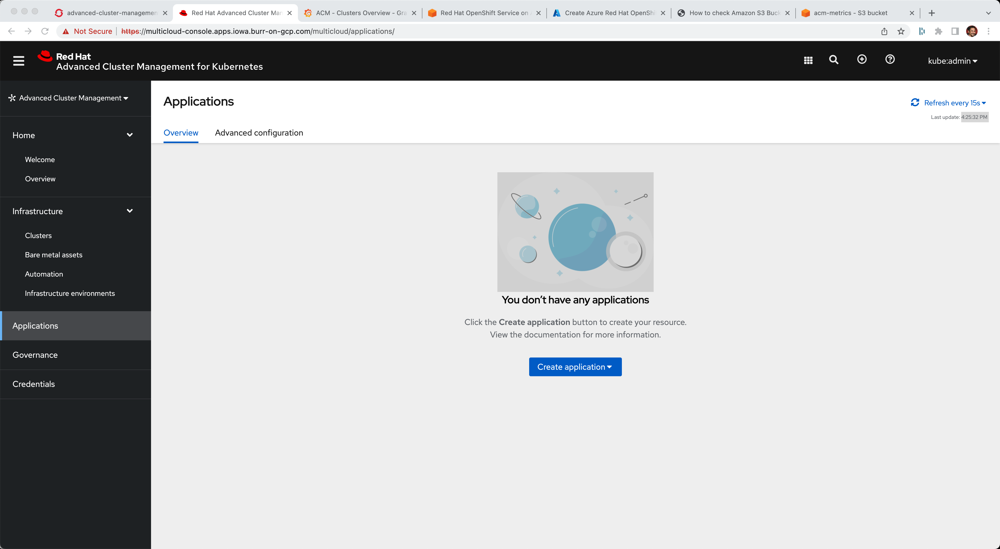[Applications]

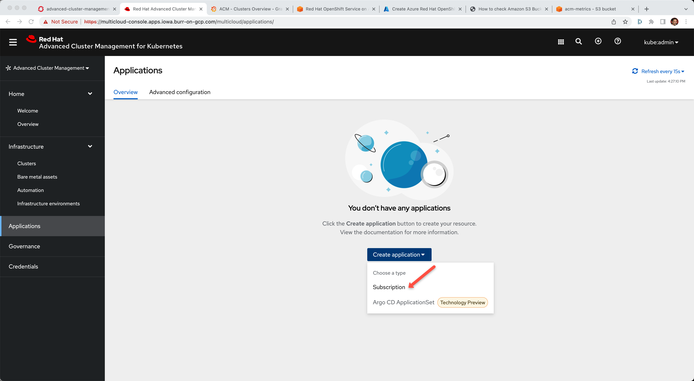[Subscription]

*Name:* book-import 

*Namespace:* book-import 

Under repository types, select the GIT repository

Better if you fork this one and make it your own

https://github.com/burrsutter/book-import

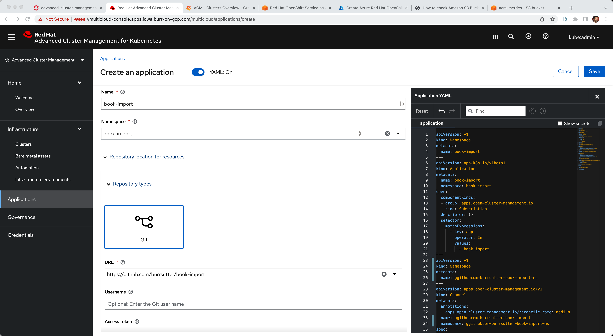[Name, Namespace]

*Branch:*  master-no-pre-post

*Path:*  book-import

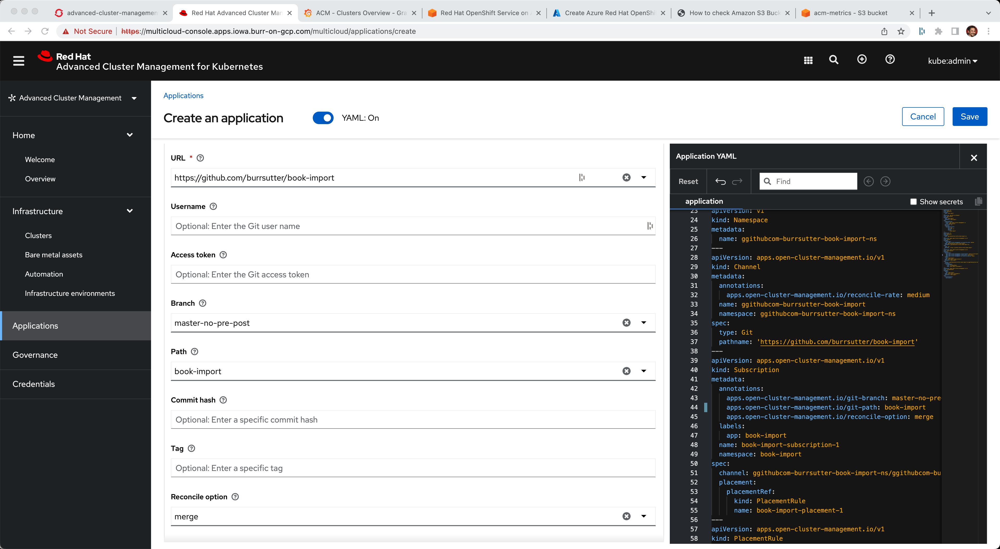[Branch, Path]

Select Deploy application resources only on clusters matching specified labels

*Label:* environment

*Value:* dev

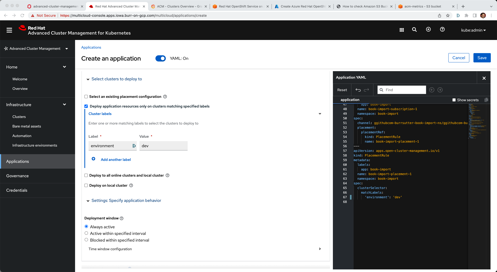[Label]

The overall Yaml

----
apiVersion: v1                    
kind: Namespace
metadata:
  name: book-import                             
---
apiVersion: app.k8s.io/v1beta1
kind: Application
metadata:
  name: book-import
  namespace: book-import
spec:
  componentKinds:
  - group: apps.open-cluster-management.io
    kind: Subscription
  descriptor: {}
  selector:
    matchExpressions:
      - key: app
        operator: In
        values: 
          - book-import
---
apiVersion: v1                      
kind: Namespace
metadata:
  name: ggithubcom-burrsutter-book-import-ns
---
apiVersion: apps.open-cluster-management.io/v1
kind: Channel
metadata:
  annotations:
    apps.open-cluster-management.io/reconcile-rate: medium
  name: ggithubcom-burrsutter-book-import
  namespace: ggithubcom-burrsutter-book-import-ns
spec:
  type: Git
  pathname: 'https://github.com/burrsutter/book-import'
---
apiVersion: apps.open-cluster-management.io/v1
kind: Subscription
metadata:
  annotations:
    apps.open-cluster-management.io/git-branch: master-no-pre-post
    apps.open-cluster-management.io/git-path: book-import
    apps.open-cluster-management.io/reconcile-option: merge
  labels:
    app: book-import
  name: book-import-subscription-1
  namespace: book-import
spec:
  channel: ggithubcom-burrsutter-book-import-ns/ggithubcom-burrsutter-book-import
  placement:
    placementRef:
      kind: PlacementRule
      name: book-import-placement-1
---
apiVersion: apps.open-cluster-management.io/v1
kind: PlacementRule
metadata:
  labels:
    app: book-import
  name: book-import-placement-1
  namespace: book-import
spec:
  clusterSelector:
    matchLabels:
      'environment': 'dev'

----

and Click Save

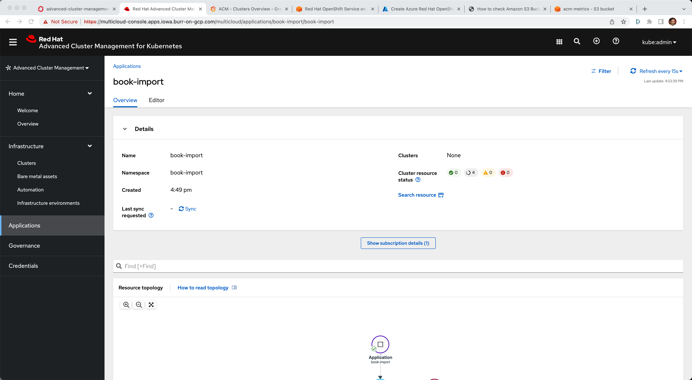[App Topology]

And notice the placement rule red X

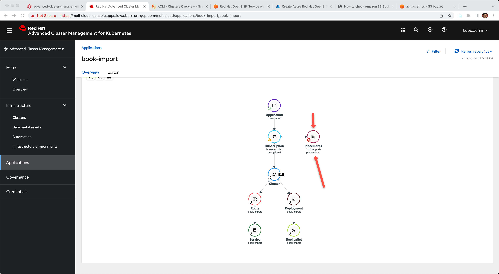[Placement Rule]

Go back to the cluster you wish to target and add the Label

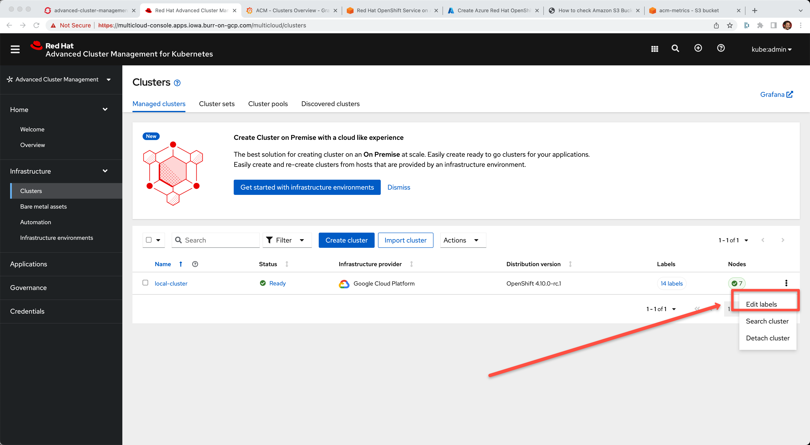[Edit Labels]

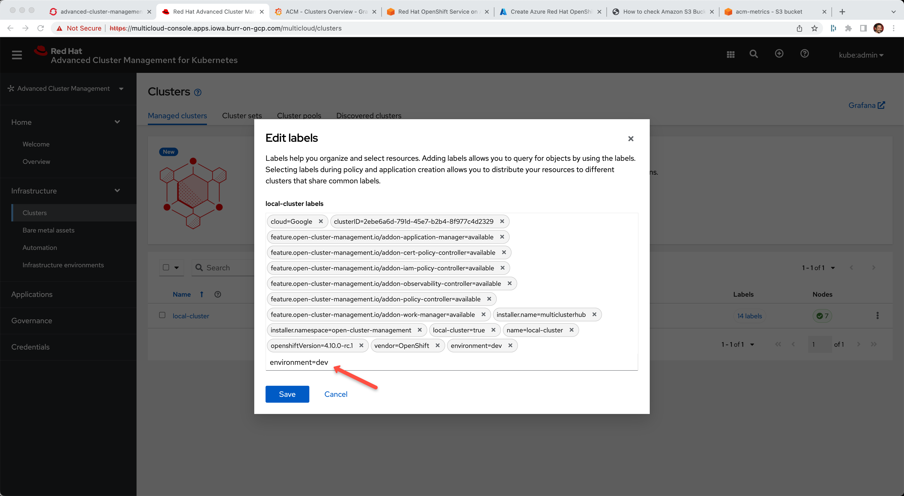[Add Labels]

Hit Return

[Add Labels]

and click Save and jump back to the Application Topology

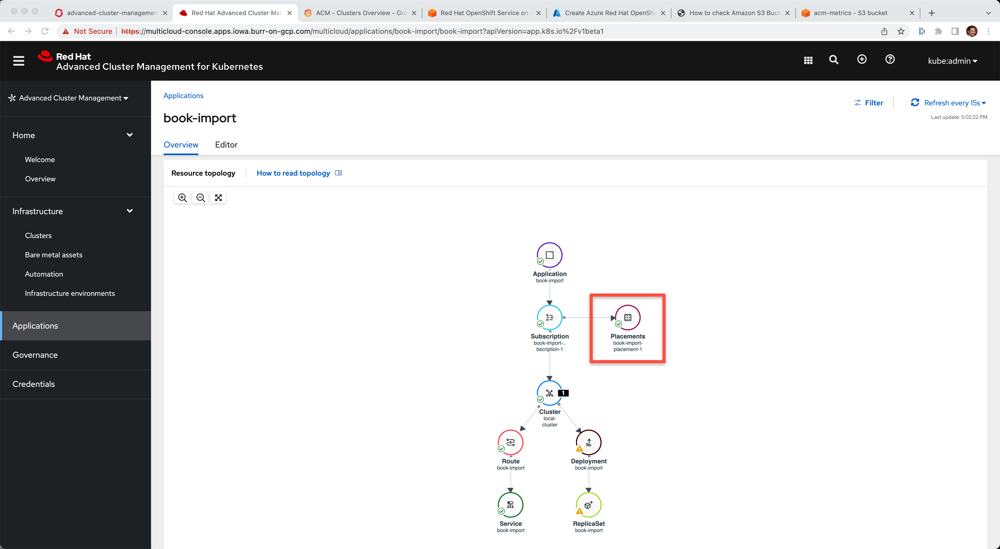[Healed Placement Rule]

Click on Route

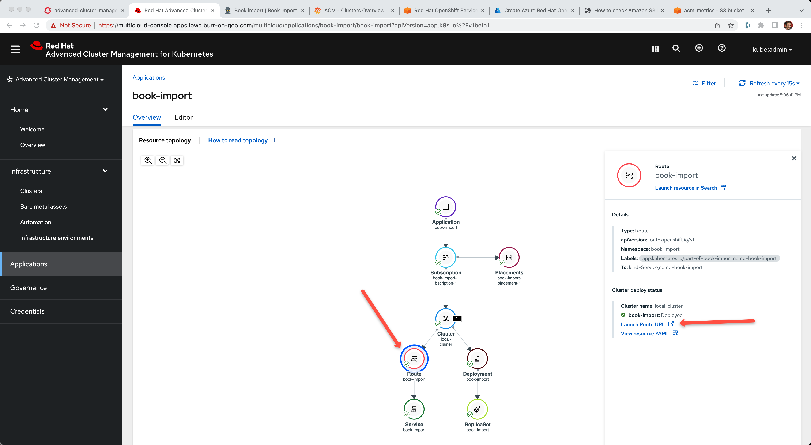[Route]

And the resulting application

[Books]

## Lots of ACM Applications

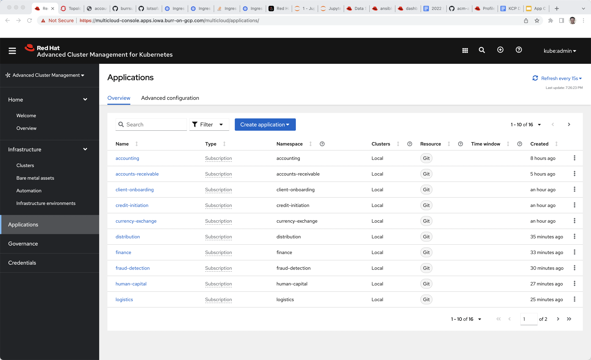[Lots of Apps]

Fork https://github.com/burrsutter/lotsofapps

----
git clone https://github.com/burrsutter/lotsofapps

cd lotsofapps

kubectl apply -k acm-manifests/accounting/
kubectl apply -k acm-manifests/accounts-receivable/
kubectl apply -k acm-manifests/client-onboarding/
kubectl apply -k acm-manifests/credit-initiation/
kubectl apply -k acm-manifests/currency-exchange/
kubectl apply -k acm-manifests/distribution/
kubectl apply -k acm-manifests/finance/
kubectl apply -k acm-manifests/fraud-detection/
kubectl apply -k acm-manifests/human-capital/
kubectl apply -k acm-manifests/logistics/
kubectl apply -k acm-manifests/manufacturing/
kubectl apply -k acm-manifests/mastercard-processor/
kubectl apply -k acm-manifests/plant-maintenance/
kubectl apply -k acm-manifests/production-planning/
kubectl apply -k acm-manifests/sales/
kubectl apply -k acm-manifests/visa-processor/
----

