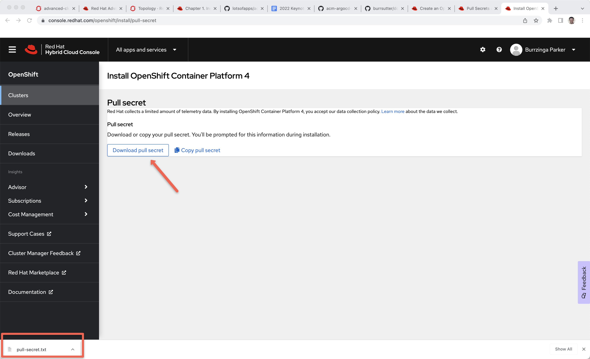
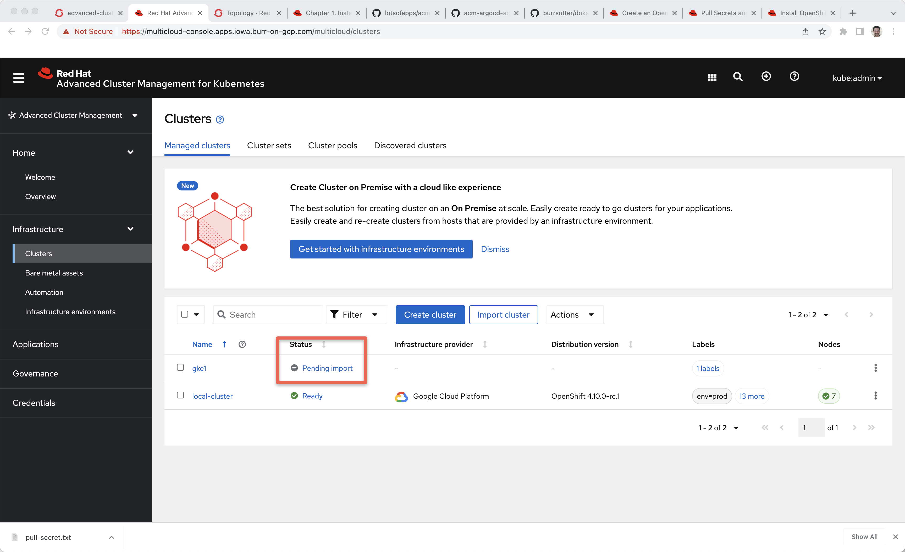

## Importing Clusters

Importing of clusters such as GKE, AKS, EKS or DOKS

. Assumes you have an ACM Hub running on top of a OCP
. Create some Spoke clusters
. Download pull-secret.txt from console.redhat.com
. Add the pull-secret in open-cluster-management
. Update the MultiClusterHub with the pull-secret
. On the Hub, create a namespace to represent the Spoke cluster
. Label that namespace as a managedCluster
. Create a ManagedCluster 
. Create a KlusterletAddonConfig
. Export the klusterlet-crd.yaml
. Export the import.yaml
. On the Spoke, apply the klusterlet-crd.yaml
. On the Spoke, apply the import.yaml

#### Create Spoke Clusters

----
doctl kubernetes cluster create blr1-kubernetes --region blr1 --node-pool="name=worker-pool;count=2"
export KUBECONFIG=/Users/burr/devnation/doks-argocd/.kube/config-blr1
doctl k8s cluster kubeconfig show blr1-kubernetes >> $KUBECONFIG

doctl kubernetes cluster list
----

----
export KUBECONFIG=/Users/burr/xKS/.kubeconfig/gke1

gcloud container clusters create gke1 --zone us-central1-c --project alohaburr
gcloud container clusters get-credentials gke1 --zone us-central1-c --project alohaburr

gcloud container clusters list --project alohaburr

# or

export KUBECONFIG=/Users/burr/xKS/.kubeconfig/gke1

gcloud container clusters create frankfurt --zone europe-west3-a --node-pool default-pool --num-nodes 3
gcloud container clusters get-credentials frankfurt --zone europe-west3-a

gcloud container clusters list
----

#### Pull Secret

Download your pull secret
https://console.redhat.com/openshift/install/pull-secret

[Pull Secret]

Switch to the open-cluster-management namespace

----
kubectl config set-context --current --namespace=open-cluster-management
# or 
oc project open-cluster-management
----

Add the secret 

----
kubectl create secret generic mypullsecret -n open-cluster-management --from-file=.dockerconfigjson=$HOME/Downloads/pull-secret.txt --type=kubernetes.io/dockerconfigjson
----

Update the MCH

----
cat <<EOF | kubectl apply -f -
apiVersion: operator.open-cluster-management.io/v1
kind: MultiClusterHub
metadata:
  name: multiclusterhub
  namespace: open-cluster-management
spec:
  imagePullSecret: mypullsecret
EOF
----

#### Create the ManagedCluster

----
kubectl create namespace gke1
kubectl label namespace gke1 cluster.open-cluster-management.io/managedCluster=gke1
----

----
cat <<EOF | oc apply -f -
apiVersion: cluster.open-cluster-management.io/v1
kind: ManagedCluster
metadata:
  name: gke1
spec:
  hubAcceptsClient: true
EOF
----

You should see "Pending Import"

[Pending Import]

Create the KlusterletAddonConfig

----
cat <<EOF | kubectl apply -f -
apiVersion: agent.open-cluster-management.io/v1
kind: KlusterletAddonConfig
metadata:
  name: gke1
  namespace: gke1
spec:
  clusterName: gke1
  clusterNamespace: gke1
  applicationManager:
    enabled: true
  certPolicyController:
    enabled: true
  clusterLabels:
    cloud: auto-detect
    vendor: auto-detect
  iamPolicyController:
    enabled: true
  policyController:
    enabled: true
  searchCollector:
    enabled: true
  version: 2.1.0
EOF
----

#### Update the Spoke Cluster

Documentation Links

https://access.redhat.com/documentation/en-us/red_hat_advanced_cluster_management_for_kubernetes/2.1/html/manage_cluster/importing-a-target-managed-cluster-to-the-hub-cluster#importing-a-managed-cluster-with-the-cli

https://access.redhat.com/documentation/en-us/red_hat_advanced_cluster_management_for_kubernetes/2.1/html/manage_cluster/importing-a-target-managed-cluster-to-the-hub-cluster#importing-an-existing-cluster-with-the-console

https://access.redhat.com/documentation/en-us/red_hat_advanced_cluster_management_for_kubernetes/2.4/html/install/installing#advanced-config-hub
