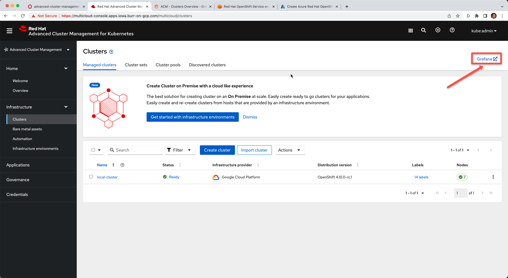

# ACM Multi-cluster Metrics (Thanos)

1. Create an S3 bucket
2. Create the open-cluster-management-observability namespace
3. Create a Secret
4. Create the CR
5. Find the URL

Using the AWS https://docs.aws.amazon.com/cli/latest/userguide/getting-started-install.html[CLI]

Know thy AWS Access Key and Secret Access Key
----
aws configure
----

#### AWS s3 bucket creation

----
aws s3api create-bucket --bucket acm-metrics --region us-east-2                                        
aws s3api put-public-access-block --bucket acm-metrics --public-access-block-configuration "BlockPublicAcls=true,IgnorePublicAcls=true,BlockPublicPolicy=true,RestrictPublicBuckets=true"
----

#### And check your bucket

----
aws s3api list-buckets
{
    "Buckets": [
        {
            "Name": "acm-metrics",
            "CreationDate": "2022-03-17T12:18:52+00:00"
        }
    ]
}
#
aws s3api get-bucket-location --bucket acm-metrics
{
    "LocationConstraint": "us-east-2"
}
----

#### Namespace creation for open-cluster-management-observability

----
oc new-project open-cluster-management-observability
# OR
kubectl create namespace open-cluster-management-observability
kubectl config set-context --current --namespace=open-cluster-management-observability
----

#### Secret creation: replace AWSACCESSKEY and SECRETACCESSKEY

Note: the endpoint includes the region

----
cat <<EOF | kubectl apply -f -
apiVersion: v1
stringData:
  thanos.yaml: |
    type: s3
    config:
      bucket: acm-metrics
      endpoint: s3.us-east-2.amazonaws.com
      insecure: false
      access_key: AWSACCESSKEY
      secret_key: SECRETACCESSKEY
metadata:
  name: thanos-object-storage
  namespace: open-cluster-management-observability
type: Opaque
kind: Secret
EOF
----

#### Create CR

----
cat <<EOF | kubectl apply -f -
apiVersion: observability.open-cluster-management.io/v1beta2
kind: MultiClusterObservability
metadata:
  name: observability
spec:
  observabilityAddonSpec: {}
  retentionConfig: {}
  storageConfig:
    metricObjectStorage:
      name: thanos-object-storage
      key: thanos.yaml
EOF
----

#### Watch for pods

----
watch kubectl get pods
NAME                                                       READY   STATUS    RESTARTS       AGE
observability-alertmanager-0                               3/3     Running   0              50m
observability-alertmanager-1                               3/3     Running   0              49m
observability-alertmanager-2                               3/3     Running   0              49m
observability-grafana-7855cfb5d9-qcc5x                     2/2     Running   0              50m
observability-grafana-7855cfb5d9-xkbmh                     2/2     Running   0              50m
observability-observatorium-api-655748549-622z5            1/1     Running   0              50m
observability-observatorium-api-655748549-z4fxj            1/1     Running   0              50m
observability-observatorium-operator-78b49598dc-ft74k      1/1     Running   0              50m
observability-rbac-query-proxy-598bcd6db8-mdn78            2/2     Running   0              50m
observability-rbac-query-proxy-598bcd6db8-p59wd            2/2     Running   0              50m
observability-thanos-compact-0                             1/1     Running   0              50m
observability-thanos-query-5bdb6c7bff-8hwvj                1/1     Running   0              50m
observability-thanos-query-5bdb6c7bff-sfk68                1/1     Running   0              50m
observability-thanos-query-frontend-749864469d-9t88w       1/1     Running   0              50m
observability-thanos-query-frontend-749864469d-tb24p       1/1     Running   0              50m
observability-thanos-query-frontend-memcached-0            2/2     Running   0              50m
observability-thanos-query-frontend-memcached-1            2/2     Running   0              49m
observability-thanos-query-frontend-memcached-2            2/2     Running   0              49m
observability-thanos-receive-controller-5b5d8bd59d-2cbfg   1/1     Running   0              50m
observability-thanos-receive-default-0                     1/1     Running   0              50m
observability-thanos-receive-default-1                     1/1     Running   0              49m
observability-thanos-receive-default-2                     1/1     Running   0              49m
observability-thanos-rule-0                                2/2     Running   0              50m
observability-thanos-rule-1                                2/2     Running   0              49m
observability-thanos-rule-2                                2/2     Running   0              48m
observability-thanos-store-memcached-0                     2/2     Running   0              50m
observability-thanos-store-memcached-1                     2/2     Running   0              49m
observability-thanos-store-memcached-2                     2/2     Running   0              49m
observability-thanos-store-shard-0-0                       1/1     Running   0              50m
observability-thanos-store-shard-1-0                       1/1     Running   0              50m
observability-thanos-store-shard-2-0                       1/1     Running   0              50m
----

#### Find the URL 

[Grafana Link]

image::./images/acm-metrics-dashboard.png[][Grafana Dashboard]
