#### Automated Installation

An excellent video of you need an introduction to what Advanced Cluster Security is at 
https://www.youtube.com/watch?v=k1jO8iYgPkY[Video Overview]

----
git clone https://github.com/redhat-cop/gitops-catalog
cd advanced-cluster-security-operator
oc apply -k advanced-cluster-security-operator/operator/overlays/latest
----

and wait a bit

----
watch kubectl get pods -n openshift-operators
NAME                                                 READY   STATUS    RESTARTS   AGE
rhacs-operator-controller-manager-76b86498df-99nxm   2/2     Running   0          4m14s
----

Then

----
oc apply -k advanced-cluster-security-operator/instance/overlays/default
----

and wait a bit

----
watch kubectl get pods -n stackrox
NAME                                 READY   STATUS      RESTARTS   AGE
admission-control-6555698c7d-bgz6d   1/1     Running     0          6m38s
admission-control-6555698c7d-bz85d   1/1     Running     0          6m38s
admission-control-6555698c7d-ws2vz   1/1     Running     0          6m38s
central-69f695646b-knxv6             1/1     Running     0          7m30s
collector-6gssh                      2/2     Running     0          6m38s
collector-7h8sf                      2/2     Running     0          6m38s
collector-7m5mm                      2/2     Running     0          6m38s
collector-ts4ml                      2/2     Running     0          6m38s
collector-w6drv                      2/2     Running     0          6m38s
collector-x8s2q                      2/2     Running     0          6m38s
create-cluster-init-bundle-cfsm6     0/1     Completed   0          7m56s
scanner-55d9cb8b8-dbsjz              1/1     Running     0          7m30s
scanner-55d9cb8b8-j5x69              1/1     Running     0          7m30s
scanner-db-585c856476-4vdqt          1/1     Running     0          7m30s
sensor-6bcc4-4qbdj                   1/1     Running     0          6m38s
----

A job named create-cluster-init-bundle makes the single Central cluster and a SecuredCluster as well

Get the URL to ACS Central

----
CENTRAL_URL=https://$(kubectl -n stackrox get route central -o jsonpath="{.status.ingress[0].host}")
open $CENTRAL_URL
----

and get the admin password

----
CENTRAL_PASSWORD=$(kubectl -n stackrox get secret central-htpasswd -o go-template='{{index .data "password" | base64decode}}')
echo $CENTRAL_PASSWORD
----

image::./images/acs-auto-1.png[][ACS Central]

#### GUI/Manual Installation

Install Operator

Go to the OperatorHub, select Advanced Cluster Security for Kubernetes, click Install 2 times.

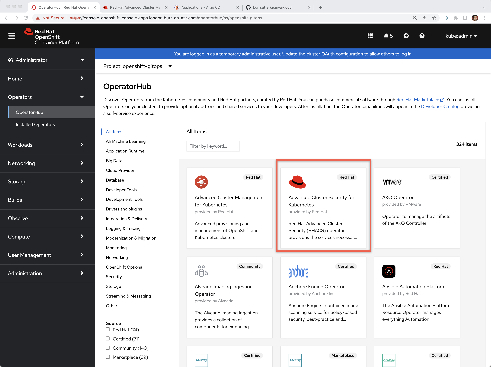[Operator Hub ACS]

----
kubectl get pods -n rhacs-operator
NAME                                                 READY   STATUS    RESTARTS   AGE
rhacs-operator-controller-manager-5f8b8d8d45-kvm2z   2/2     Running   0          29m
----

Create "stackrox" Project/Namespace

image::./images/acs-0-1.png[][Create Project]

Go to Installed Operators

image::./images/acs-1.png[][Installed Operators]

Click on "Advanced Cluster Security for Kubernetes" and then "Create Instance"

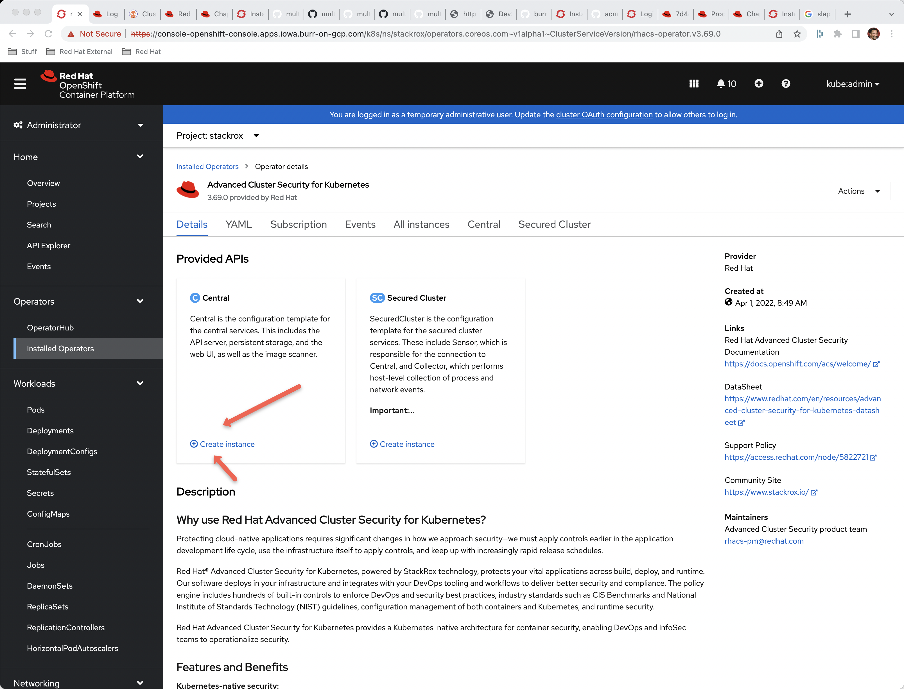[Create Instance]

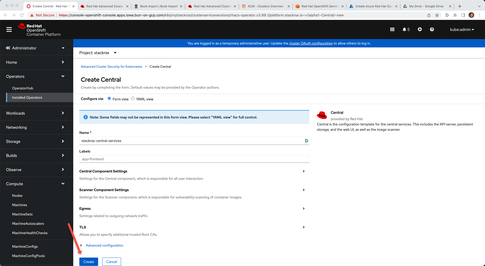[Create Instance]

This will populate your stackrox namespace with pods

----
kubectl get pods -n stackrox
NAME                          READY   STATUS    RESTARTS   AGE
central-f5c7875dc-9bsrg       1/1     Running   0          101s
scanner-5dcc5bd4b5-95kvf      1/1     Running   0          100s
scanner-5dcc5bd4b5-kpffz      1/1     Running   0          101s
scanner-5dcc5bd4b5-nstfs      1/1     Running   0          101s
scanner-db-57cdc49d74-6xn84   1/1     Running   0          101s
----

Now time to seek out the autogenerated password for access to the Central UI

Go to Secrets

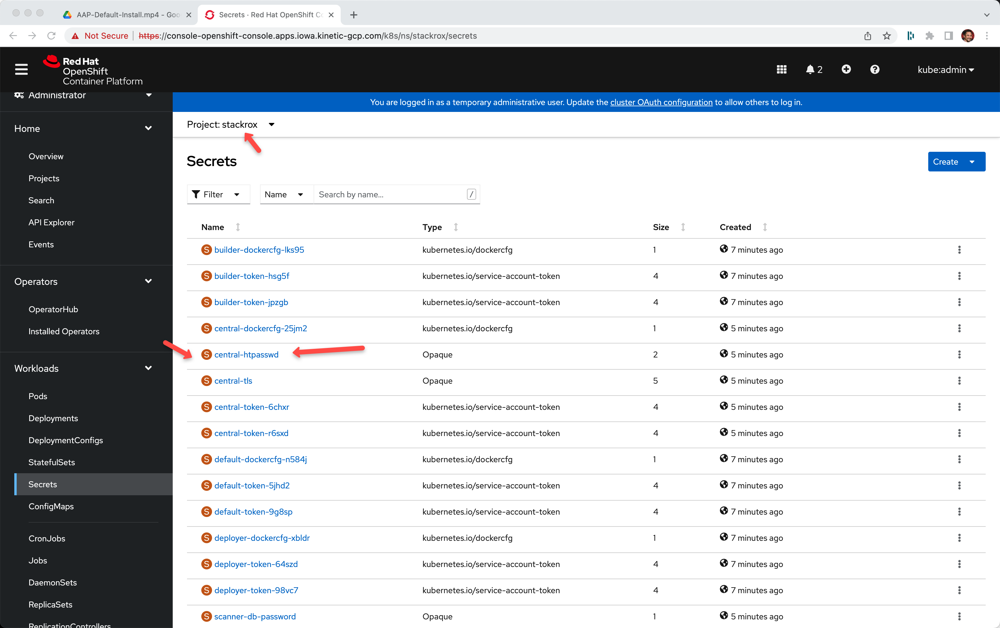[Secrets]

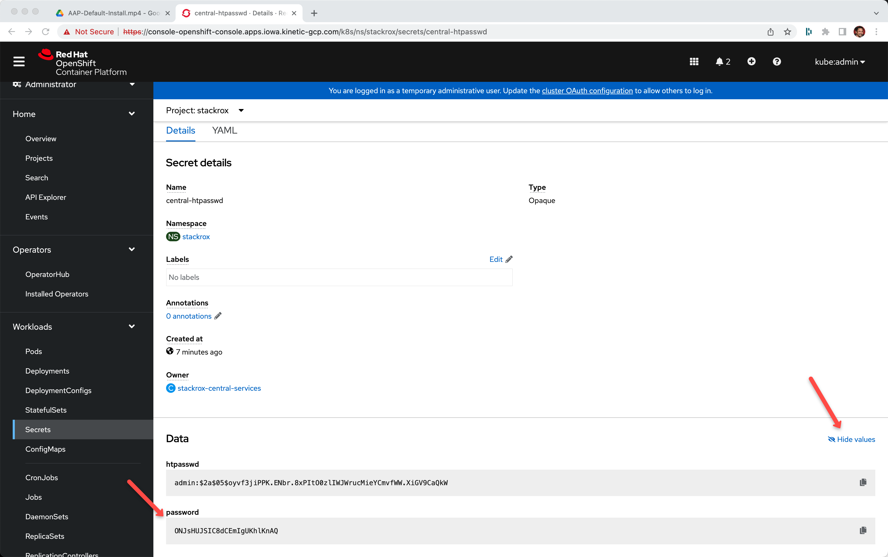[central-htpasswd]

Or using the CLI

----
kubectl -n stackrox get secret central-htpasswd -o go-template='{{index .data "password" | base64decode}}'
5xABwer78myRqwerqw13xyz10
----

Find the URL to the ACS Central

image::./images/acs-7.png[][URL]

Or use the command line to extract it

----
kubectl -n stackrox get route central -o jsonpath="{.status.ingress[0].host}"
----

Login with "admin" and the password extracted above and voila!

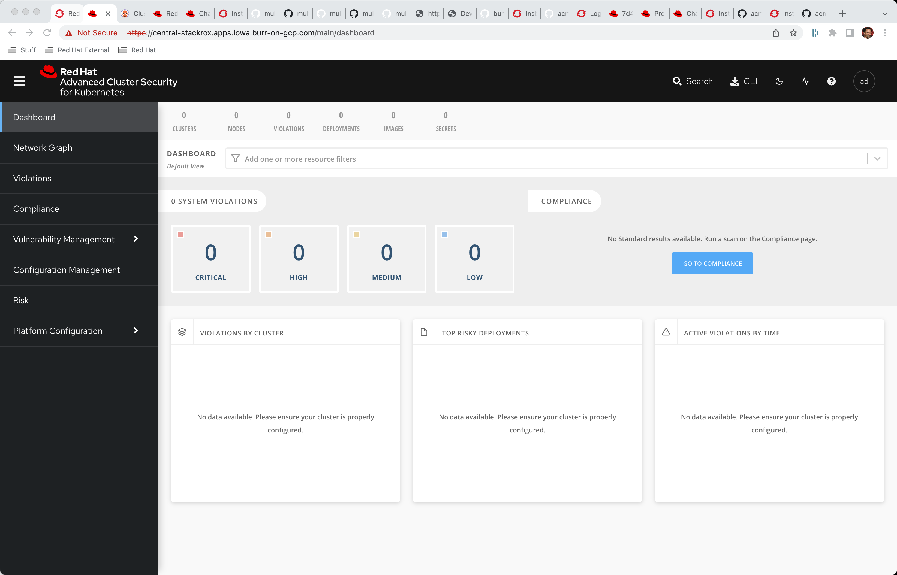[ACS Central]

You will notice that there is no data in the dashboards.  We next have to include a "secured cluster" in the overall mix.  The good news is that the Central/Hub cluster can also work as a "secured cluster".  This concept is like ACM's "managed cluster".

Inside that Central console, go to Platform Configuration, Integrations then scroll to the bottom, click on Helm Cluster Init Bundle

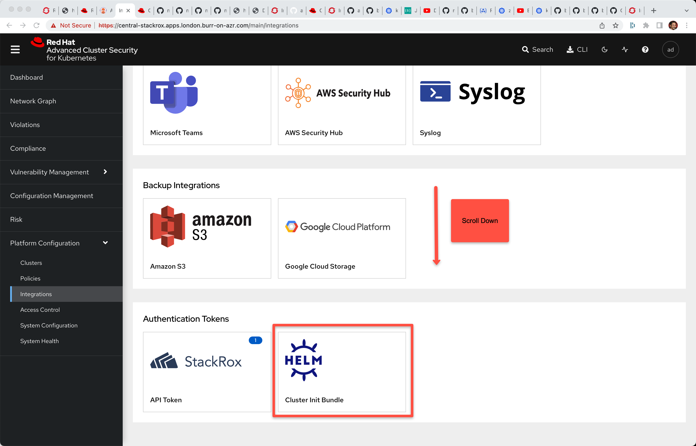[Platform Configuration, Integrations]

Click on "Generate bundle"

image::./images/acs-10.png[][Generate bundle]

Enter a name like "myinitbundle" and click Generate button

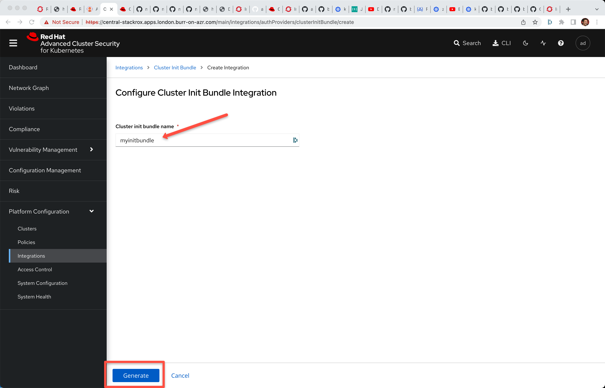[myinitbundle]

Click on Download Kubernetes Secret File to download

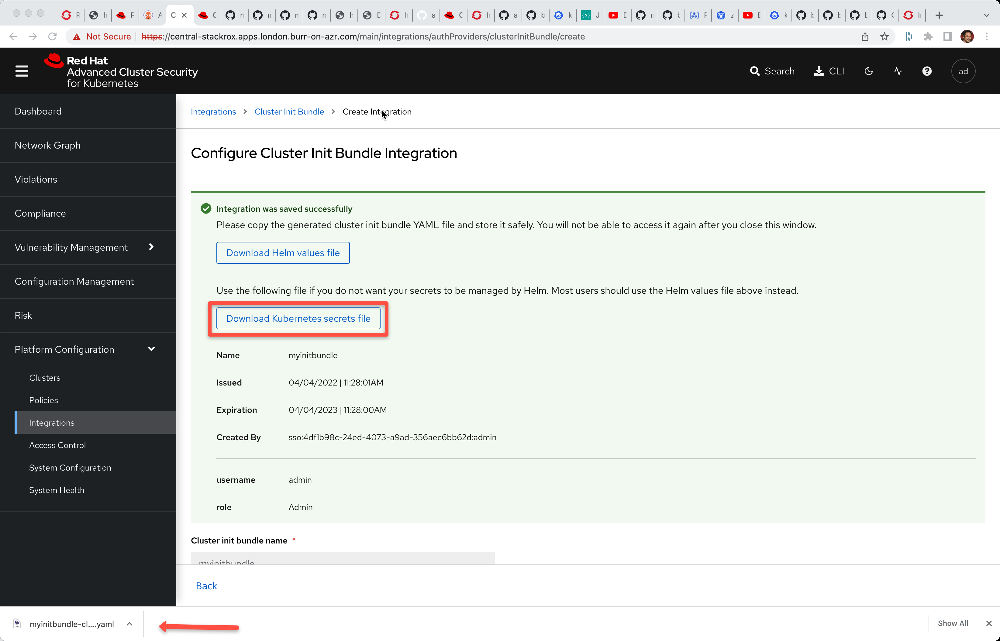[Download Kubernetes Secret File]

On the Central cluster, apply this generated .yaml
----
kubectl apply -f ~/Downloads/myinitbundle-cluster-init-secrets.yaml -n stackrox
secret/collector-tls created
secret/sensor-tls created
secret/admission-control-tls created
----

Now, back to the main OpenShift Console for Central, project stackrox, Installed Operators.

Click on Secured Cluster

image::./images/acs-13.png[][OpenShift Console - Installed Operators] 

and then Create SecuredCluster

image::./images/acs-14.png[][Create SecuredCluster] 

Give it the name "local-cluster" and the Central Endpoint is the main URL for Central but make sure to add a trailing :443 and remove http:// or https:// at the beginning

Here is a bit of script to get the Central Endpoint with the correct formatting

----
echo $(kubectl -n stackrox get route central -o jsonpath="{.status.ingress[0].host}"):443
----

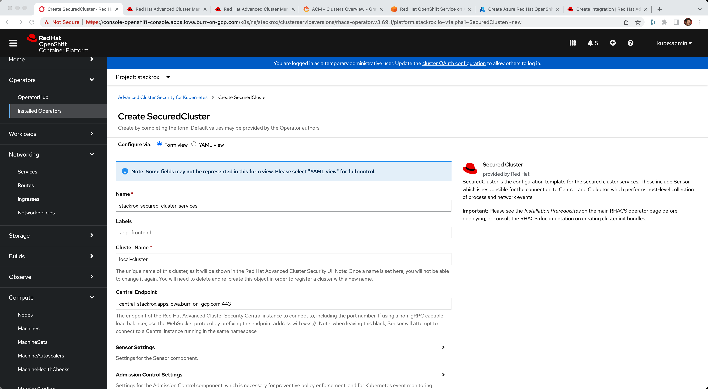[Central Endpoint] 

Scroll down, taking the default values and clicking the Create button

image::./images/acs-16.png[][Create] 

Check to see if new pods have been started inside of the stackrox namespace

----
kubectl get pods -n stackrox
NAME                                 READY   STATUS    RESTARTS   AGE
admission-control-6b5c65f767-kzwls   1/1     Running   0          9m4s
admission-control-6b5c65f767-mrd55   1/1     Running   0          9m4s
admission-control-6b5c65f767-rlcfl   1/1     Running   0          9m4s
central-f5c7875dc-9bsrg              1/1     Running   0          36m
collector-d8mkl                      2/2     Running   0          9m3s
collector-fkvxz                      2/2     Running   0          9m3s
collector-fz4lq                      2/2     Running   0          2m22s
collector-k5l8m                      2/2     Running   0          9m3s
collector-km26h                      2/2     Running   0          9m3s
collector-qxfw5                      2/2     Running   0          9m3s
collector-v88cx                      2/2     Running   0          9m4s
collector-vfvdt                      2/2     Running   0          9m3s
collector-vr68c                      2/2     Running   0          9m3s
scanner-5dcc5bd4b5-89pdq             1/1     Running   0          7m21s
scanner-5dcc5bd4b5-kpffz             1/1     Running   0          36m
scanner-5dcc5bd4b5-nstfs             1/1     Running   0          36m
scanner-db-57cdc49d74-6xn84          1/1     Running   0          36m
sensor-5d885d6bc-jpksw               1/1     Running   0          9m4s
----

Back on ACS Central UI, 

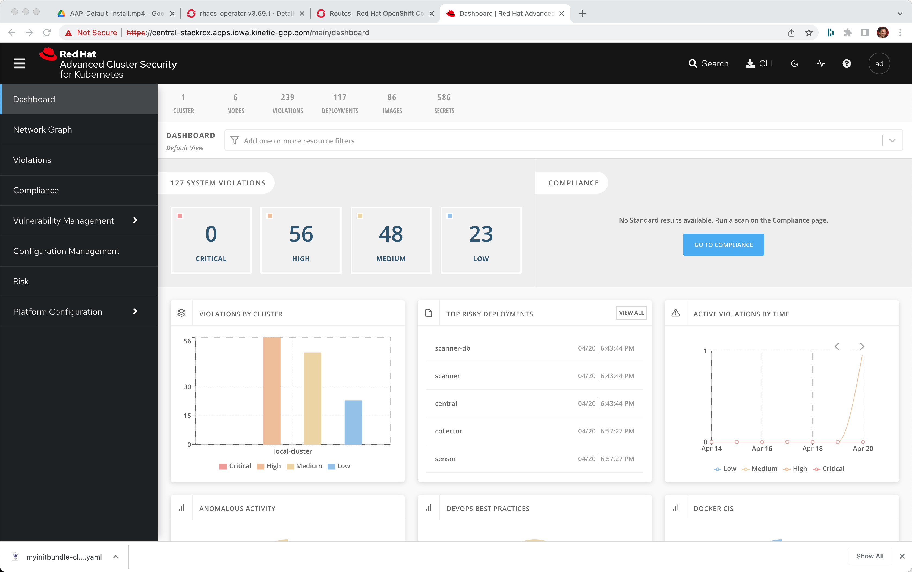[Go to Compliance]

The actual numbers in the dashboard will vary depending on the number of active CVEs there are right this moment.  This data is constantly updating based on the age of your OpenShift and the things that have been deployed into your base cluster.

Go To Compliance

Scan Environment

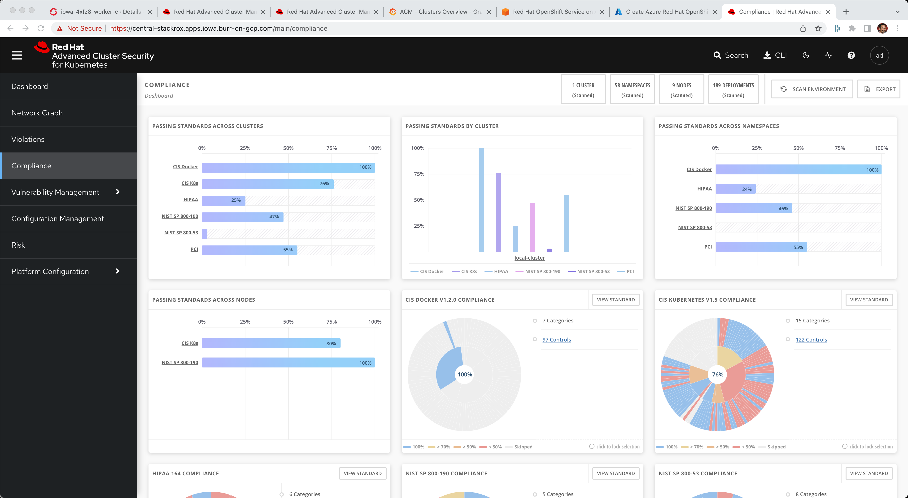[Scan Environment]

Load in some "bad stuff"

----
oc new-project test
oc run shell --labels=app=shellshock,team=test-team \
  --image=vulnerables/cve-2014-6271 -n test
----

----
oc run samba --labels=app=rce --image=vulnerables/cve-2017-7494 -n test
----

You may have to hit the Scan Environment button again

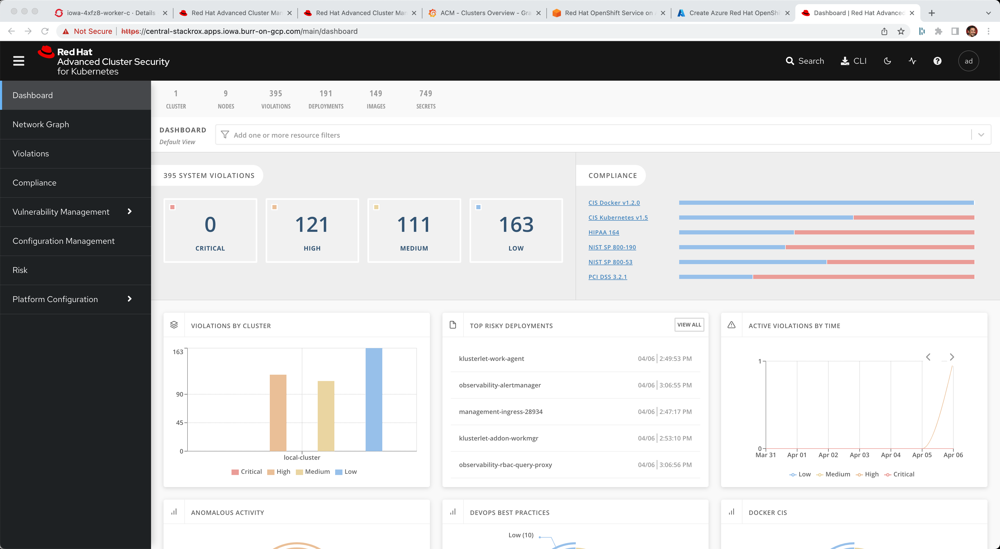[Dashboard]

----
oc new-project finance
oc adm policy add-scc-to-user -z privileged default
kubectl apply -f minerd-deployment.yaml
----

----
oc new-project devops
kubectl apply -f log4shellapp.yaml
----

----
git clone https://github.com/burrsutter/ansible-demo
# do what readme.md says
docker-compose run ansible-demo-build
----

