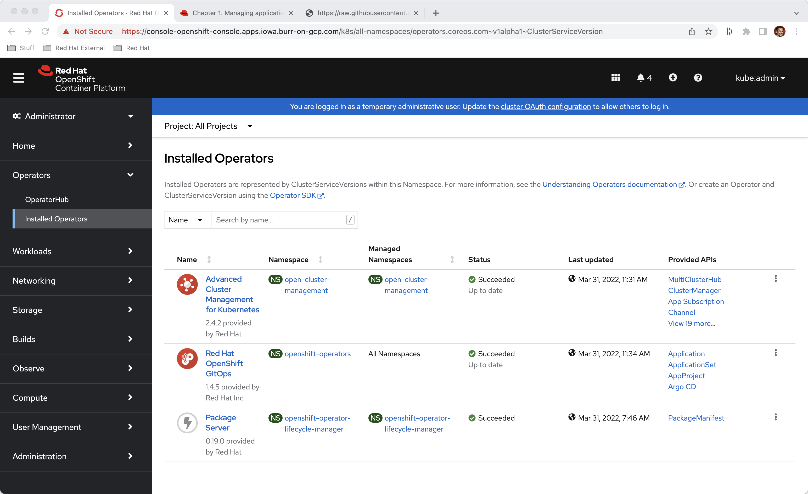
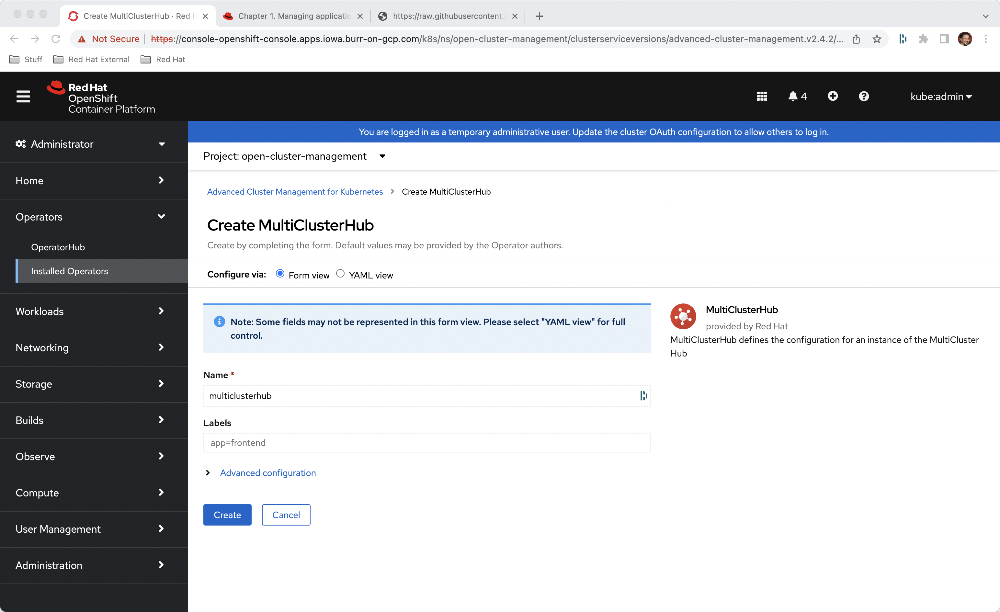
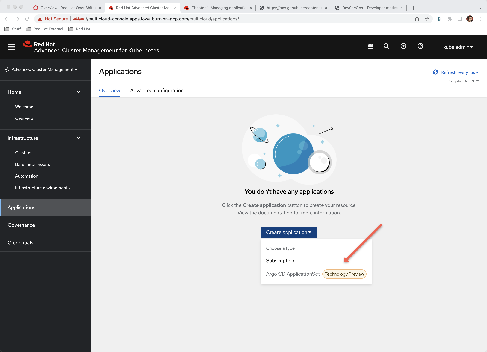
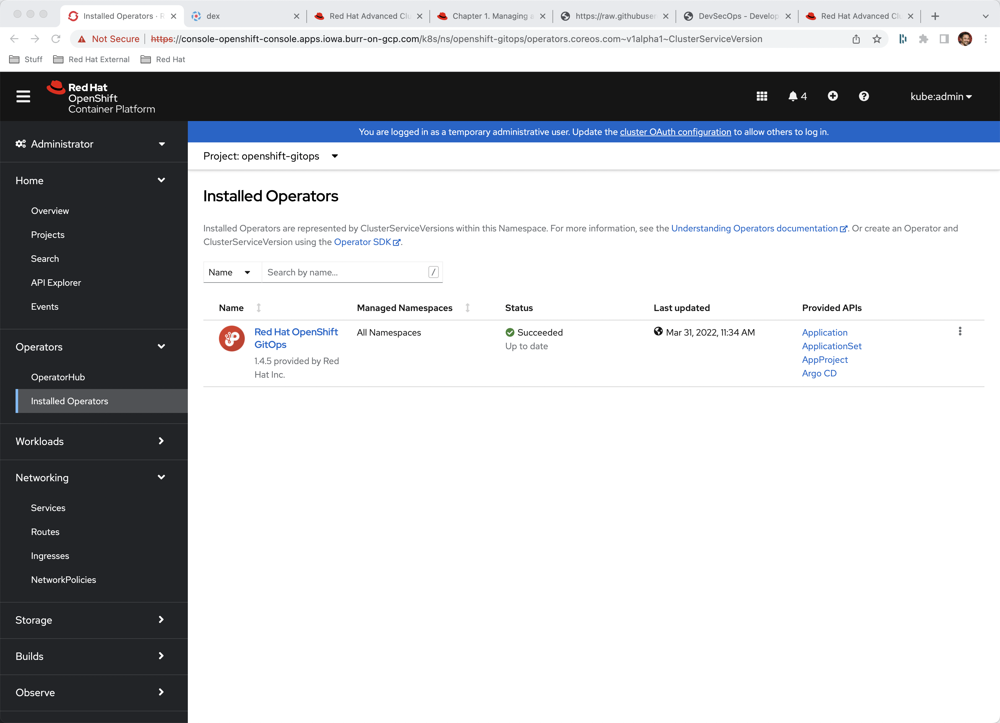
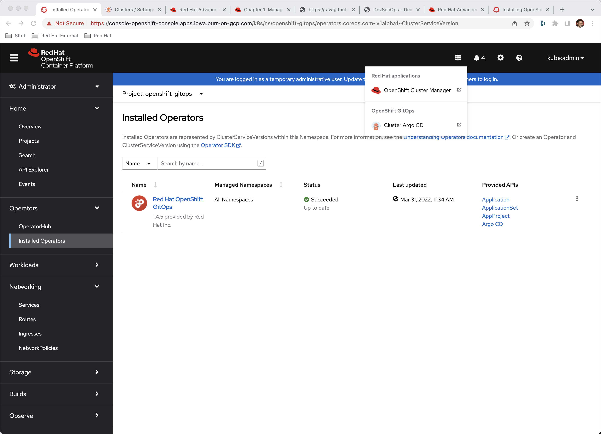
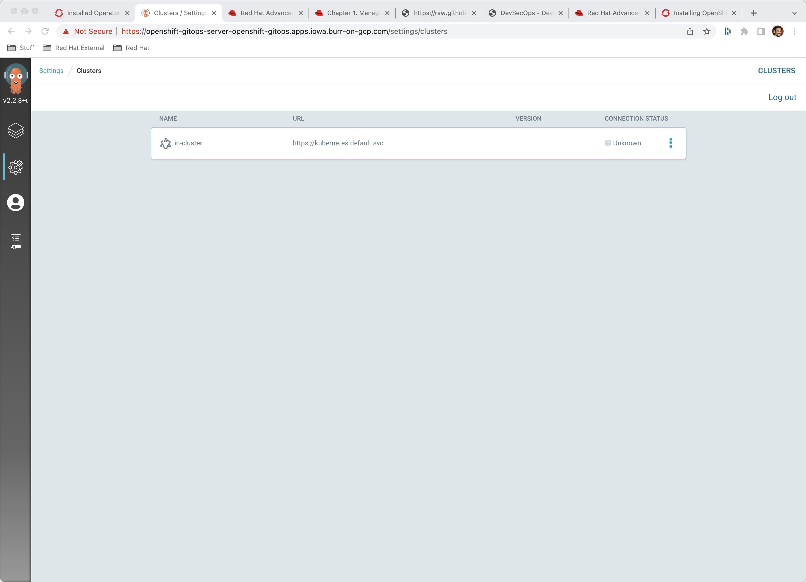
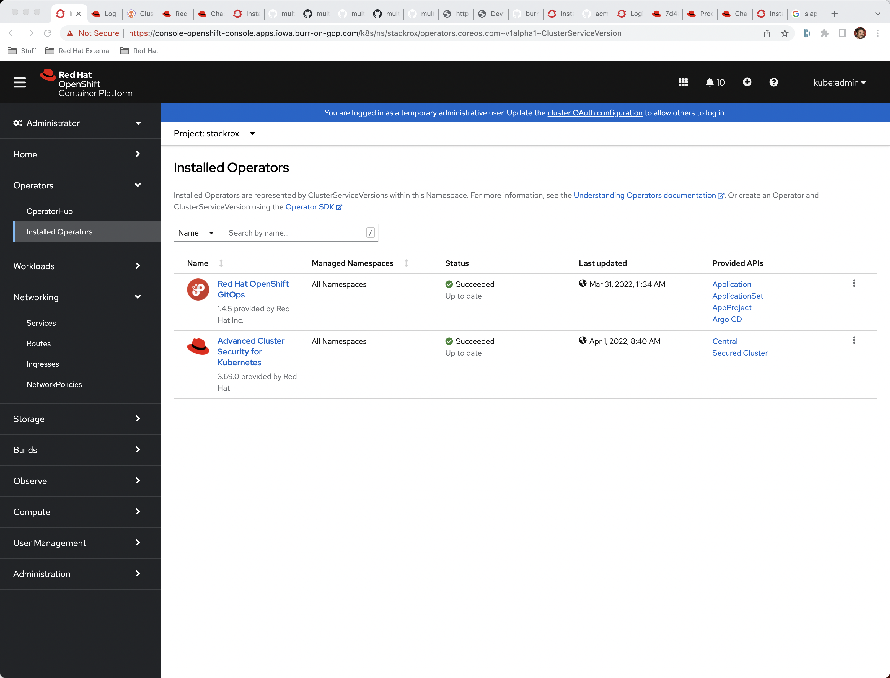
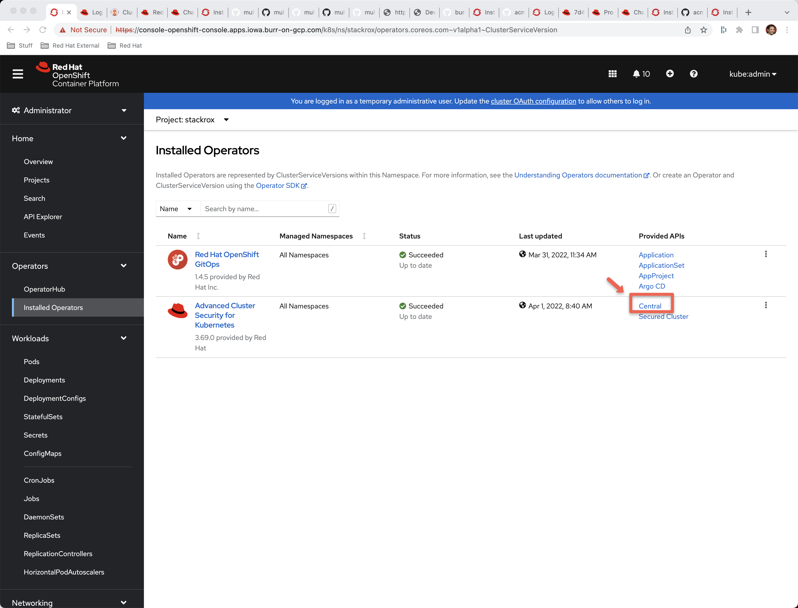
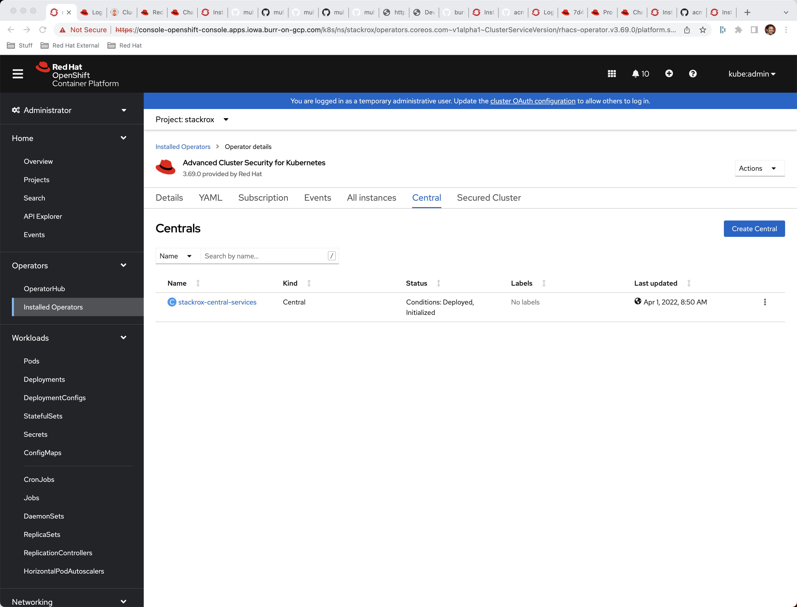
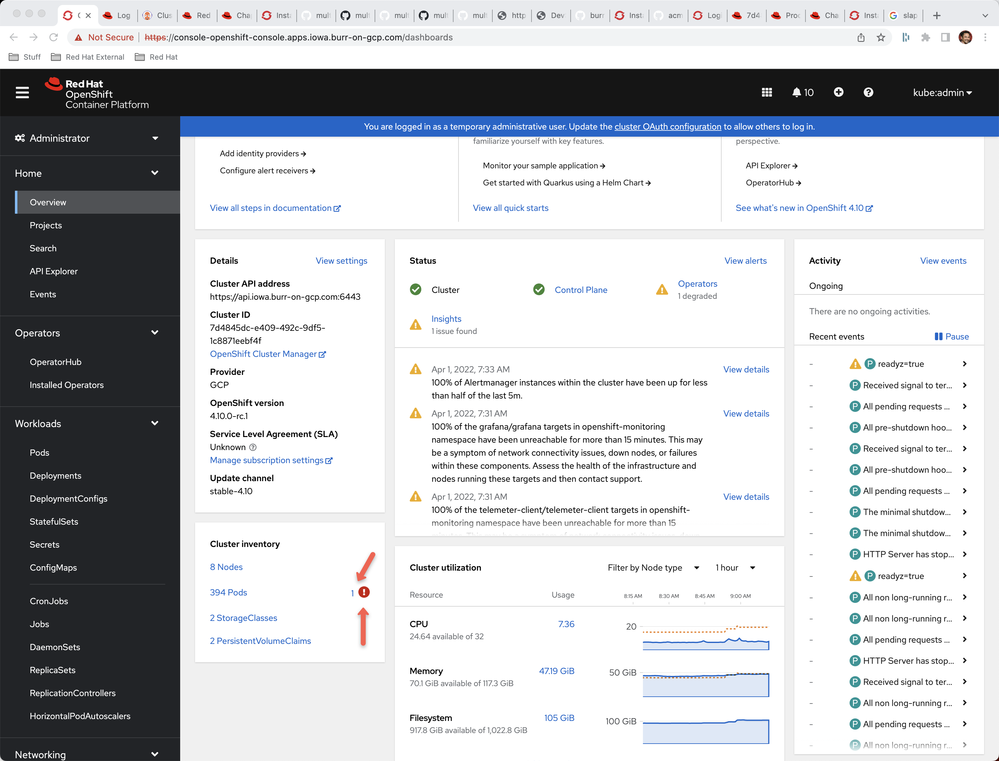

# ACM + ArgoCD (Gitops) + ACS

Install OpenShift 4.10.0-rc.1

Scale up MachineSets to have enough cores to load everything in.  

image::./images/acm-argocd-0.png[][MachineSets]

## ACM + Gitops
Install ACM Operator

Install GitOps Operator

[Installed Operators]

Create a MCH in the open-cluster-management namespace

[Create MCH]

Lots of pods show up inside of the namespace open-cluster-management
----
kubectl get pods -n open-cluster-management
NAME                                                              READY   STATUS    RESTARTS        AGE
application-chart-073e4-applicationui-75c8c76859-7c4r7            1/1     Running   0               6h35m
application-chart-073e4-applicationui-75c8c76859-hx294            1/1     Running   0               6h35m
application-chart-073e4-consoleapi-6f788d7f8-rlmmc                1/1     Running   0               6h35m
application-chart-073e4-consoleapi-6f788d7f8-thkzh                1/1     Running   0               6h35m
cluster-curator-controller-5468fc7f57-cddzm                       1/1     Running   0               6h33m
cluster-curator-controller-5468fc7f57-ntdfs                       1/1     Running   0               6h33m
cluster-manager-6ddf7d6db7-58kll                                  1/1     Running   0               6h36m
cluster-manager-6ddf7d6db7-gg2m8                                  1/1     Running   0               6h36m
cluster-manager-6ddf7d6db7-m9sxw                                  1/1     Running   0               6h36m
clusterclaims-controller-84655b7657-8s565                         2/2     Running   0               6h33m
clusterclaims-controller-84655b7657-gbd8k                         2/2     Running   0               6h33m
clusterlifecycle-state-metrics-v2-6db654df77-bqzd4                1/1     Running   0               6h33m
console-chart-bca2a-console-v2-6596cf64fd-mbnm5                   1/1     Running   0               6h35m
console-chart-bca2a-console-v2-6596cf64fd-p87xh                   1/1     Running   0               6h35m
discovery-operator-7df9f545-zqvm7                                 1/1     Running   0               6h34m
grc-47bf0-grcui-79965c5bc4-jq578                                  1/1     Running   0               6h34m
grc-47bf0-grcui-79965c5bc4-zkklt                                  1/1     Running   0               6h34m
grc-47bf0-grcuiapi-6844657f5f-2lb85                               1/1     Running   0               6h34m
grc-47bf0-grcuiapi-6844657f5f-plhbg                               1/1     Running   0               6h34m
grc-47bf0-policy-propagator-64d954f9d4-pfv4n                      2/2     Running   0               6h34m
grc-47bf0-policy-propagator-64d954f9d4-vdnzs                      2/2     Running   0               6h34m
hive-operator-8487688ddc-vvqt6                                    1/1     Running   0               6h36m
infrastructure-operator-56b697f9d4-z8b28                          1/1     Running   0               6h34m
klusterlet-addon-controller-v2-7555cd79b5-mxgp9                   1/1     Running   0               6h33m
klusterlet-addon-controller-v2-7555cd79b5-rvzrm                   1/1     Running   0               6h33m
managedcluster-import-controller-v2-6c845d7dcc-6kqxq              1/1     Running   0               6h33m
managedcluster-import-controller-v2-6c845d7dcc-f29bb              1/1     Running   0               6h33m
management-ingress-26cbb-67978cdfdf-4p26g                         2/2     Running   0               6h35m
management-ingress-26cbb-67978cdfdf-ddnjd                         2/2     Running   0               6h35m
multicluster-observability-operator-7694d56566-k2xvk              1/1     Running   0               6h36m
multicluster-operators-application-66fd799ddc-tbvqv               4/4     Running   3 (6h34m ago)   6h36m
multicluster-operators-channel-79f797457c-lt25v                   1/1     Running   1 (6h34m ago)   6h36m
multicluster-operators-hub-subscription-86f8bd4b56-rhw6c          1/1     Running   0               6h36m
multicluster-operators-standalone-subscription-6dbd85fc45-rcffx   1/1     Running   0               6h36m
multiclusterhub-operator-7cf97bd94b-nwkqx                         1/1     Running   0               6h36m
multiclusterhub-repo-6584d4f56d-fnbdd                             1/1     Running   0               6h35m
ocm-controller-7d85fd574c-c5dlx                                   1/1     Running   0               6h35m
ocm-controller-7d85fd574c-h6zbt                                   1/1     Running   0               6h35m
ocm-proxyserver-fcfbbbffb-q2l5z                                   1/1     Running   0               6h35m
ocm-proxyserver-fcfbbbffb-s24nq                                   1/1     Running   0               6h35m
ocm-webhook-fc8bfc89f-7bdrn                                       1/1     Running   0               6h35m
ocm-webhook-fc8bfc89f-b9z7k                                       1/1     Running   0               6h35m
policyreport-70b73-insights-client-56cc5b8456-5r7d2               1/1     Running   0               6h35m
policyreport-70b73-metrics-674b9795ff-wbrz6                       2/2     Running   0               6h35m
provider-credential-controller-5675474df8-g4tpr                   2/2     Running   0               6h33m
search-operator-5789b5f6d8-lrdgg                                  1/1     Running   0               6h34m
search-prod-34d1d-search-aggregator-cbc47d964-5nj52               1/1     Running   0               6h34m
search-prod-34d1d-search-api-8657d8f998-7vsrt                     1/1     Running   0               6h34m
search-prod-34d1d-search-api-8657d8f998-dbvm4                     1/1     Running   0               6h34m
search-prod-34d1d-search-collector-7b8598b85f-qfv65               1/1     Running   0               6h34m
search-redisgraph-0                                               1/1     Running   0               6h34m
search-ui-57b46786cc-frmbq                                        1/1     Running   0               6h34m
search-ui-57b46786cc-shb55                                        1/1     Running   0               6h34m
submariner-addon-6cdb45fb55-4wch7                                 1/1     Running   0               6h36m
----

If you go into Advanced Cluster Management and the Applications section, click on Create, you will see the ArgoCD ApplicationSet is disabled

[Applications in ACM]

There are some steps needed to get ArgoCD configured with ACM.  Back in the OpenShift Console - Administrator View, select the project (namespace) called "OpenShift-gitops" and Installed Operators

[Installed Operators]

And visit the ArgoCD UI
[Menu for the ArgoCD Console]

And into the Settings and Clusters
[Settings & Clusters]

Normally when working with the ArgoCD Hub you have to add your managed clusters (spokes) to it via a command like
----
argocd cluster add --kubeconfig $KUBECONFIG do-ams3-ams3-kubernetes --name amsterdam
----

You can simply just add the main/current cluster as a spoke/managed cluster but using a different technique.

----
kubectl apply -f managedclusterset.yaml -n openshift-gitops
kubectl apply -f gitopscluster.yaml -n openshift-gitops
----

----
kubectl get managedcluster -n open-cluster-management
----

Add a label to the local-cluster managed cluster

----
kubectl label managedcluster local-cluster usage=production -n open-cluster-management
# or
kubectl label managedcluster local-cluster cluster.open-cluster-management.io/clusterse=all-openshift-clusters
# or
kubectl label managedcluster local-cluster cluster.open-cluster-management.io/clusterse=all-clusters
----

Check that the label applied
----
kubectl get managedcluster -l cluster.open-cluster-management.io/clusterset=all-openshift-clusters -n open-cluster-management
NAME            HUB ACCEPTED   MANAGED CLUSTER URLS                    JOINED   AVAILABLE   AGE
local-cluster   true           https://api.iowa.burr-on-gcp.com:6443   True     True        7h48m
----

Check the Placement

----
kubectl get placement
NAME            SUCCEEDED   REASON                       SELECTEDCLUSTERS
local-cluster   False       AllManagedClusterSetsEmpty   0----
----

## ACS/StackRox
Install Operator

----
oc get pods -n rhacs-operator
NAME                                                 READY   STATUS    RESTARTS   AGE
rhacs-operator-controller-manager-5f8b8d8d45-kvm2z   2/2     Running   0          29m
----

Create "stackrox" Project/Namespace

Go to Installed Operators

[Installed Operators]

image::./images/acs-2.png[][Create Instance]

----
kubectl get pods -n stackrox
NAME                         READY   STATUS    RESTARTS   AGE
central-6b96668d45-nmpnk     1/1     Running   0          31m
scanner-7d77d75f6c-m2rmt     1/1     Running   0          31m
scanner-7d77d75f6c-xqzzq     1/1     Running   0          31m
scanner-db-77dd49d98-kbkzm   1/1     Running   0          31m
----

Now time to seek out the autogenerated password for access to the Central UI

Back to Installed Operators

[Installed Operators]

Click on Central

[Central]

Click on stackrox-central-services

image::./images/acs-5.png[][stackrox-central-services]

## Troubleshooting

As mentioned, make sure you have enough worker node cores available.  You can look for Pending pods on this section of the main Overview screen.  

[Pending?]

image::./images/acm-argocd-0.png[][MachineSets]