# ACM + ArgoCD (Gitops) + ACS

Install OpenShift 4.10.0 on Azure, AWS or GCP (or anywhere you have the authority and credit limit to do so)

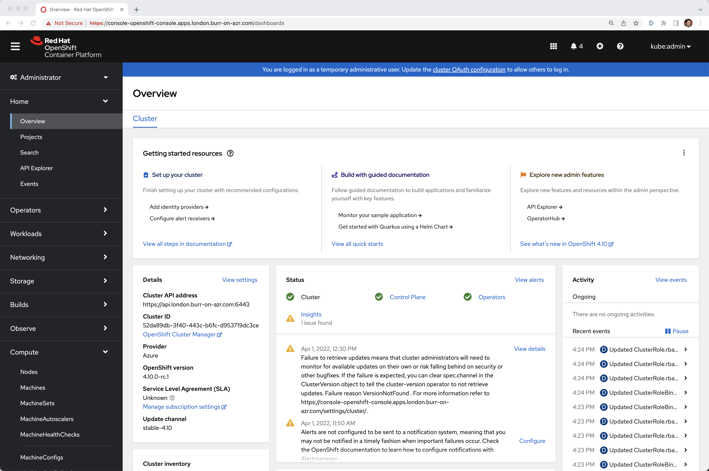[OpenShift]

Scale up MachineSets to have enough cores to load everything in.   Just click on the name of the machineset and add a node (see troubleshooting section). If you are monitoring your Azure, AWS or GCP console you will see a new VM spring to life.  It takes several minutes to provison the new worker node.

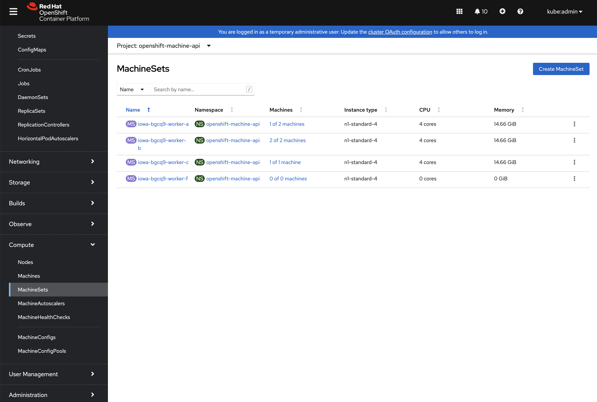[MachineSets]

## ACM + Gitops
Install ACM Operator

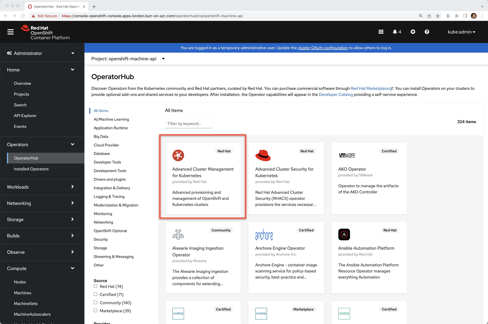[Operator Catalog]

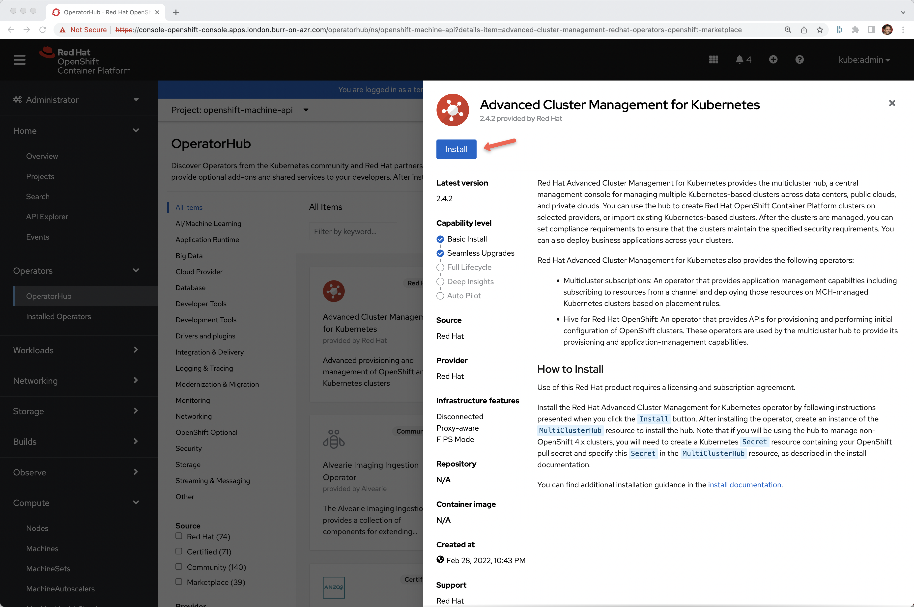[Install Button]

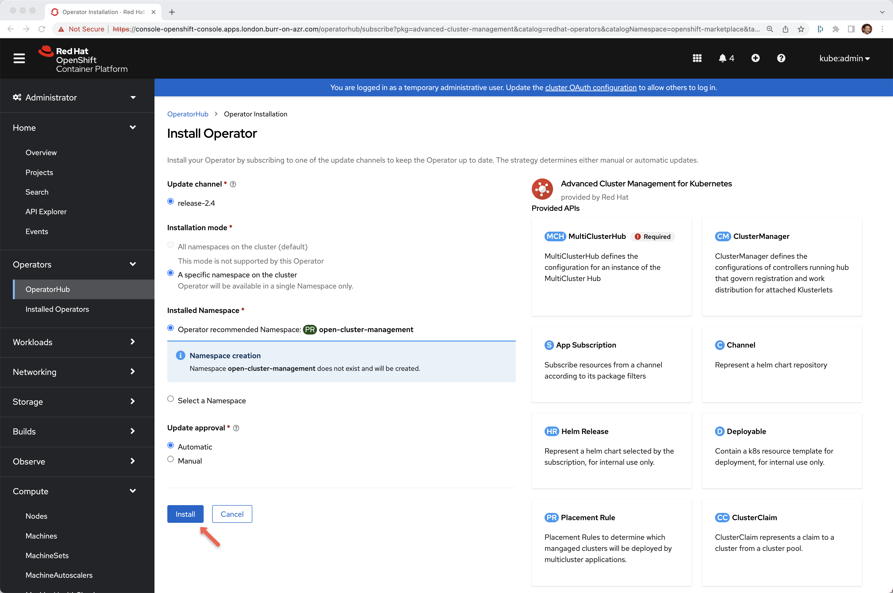[Install Button Again]

Install GitOps Operator

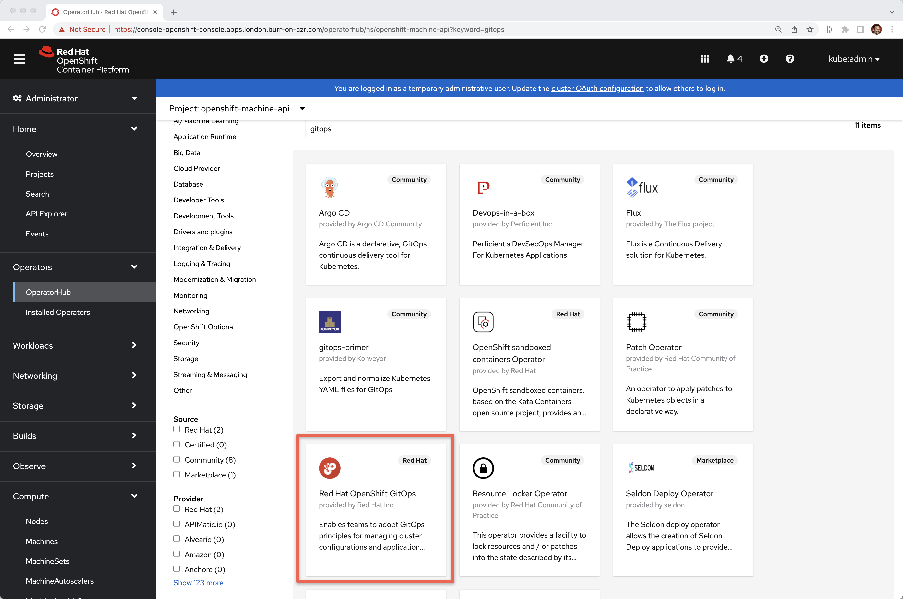[Operator Catalog: gitops]

Follow the same steps as the ACM Operator

Select All Projects and see the Installed Operators

image::./images/acm-argocd-1.png[][Installed Operators]

Switch to the open-cluster-management project/namespace. 

Create a MulticlusterHub by clicking on the link

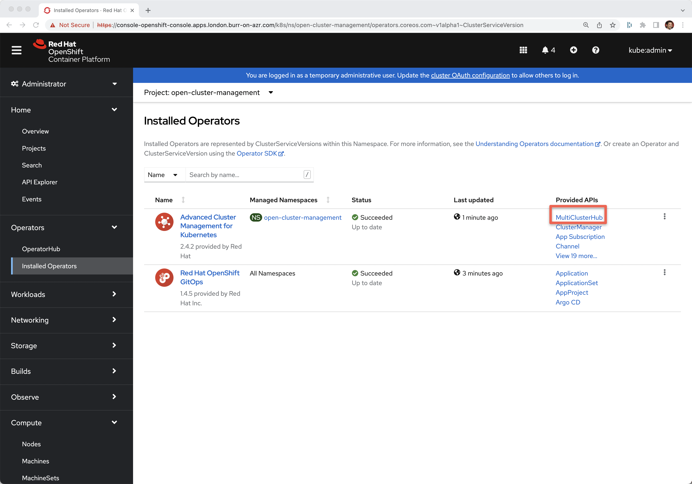[MulticlusterHub]

And click the "Create MultiClusterHub" button

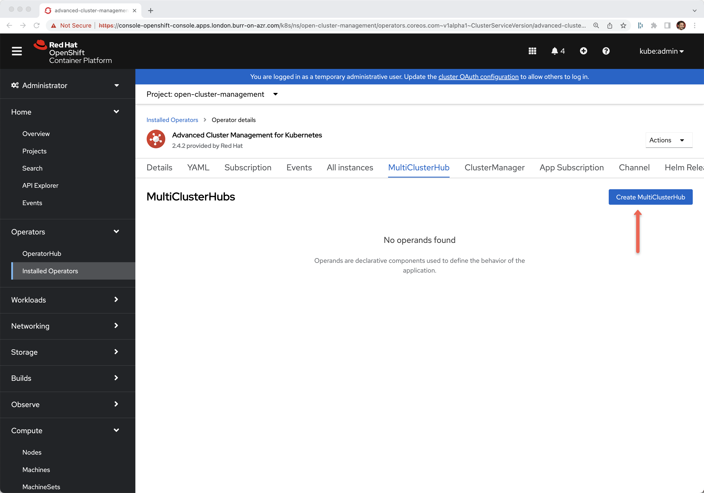[MulticlusterHub]

And one more Create button

image::./images/acm-argocd-2.png[][Create MCH]

Lots of pods show up inside of the namespace open-cluster-management
----
kubectl get pods -n open-cluster-management
NAME                                                              READY   STATUS    RESTARTS        AGE
application-chart-073e4-applicationui-75c8c76859-7c4r7            1/1     Running   0               6h35m
application-chart-073e4-applicationui-75c8c76859-hx294            1/1     Running   0               6h35m
application-chart-073e4-consoleapi-6f788d7f8-rlmmc                1/1     Running   0               6h35m
application-chart-073e4-consoleapi-6f788d7f8-thkzh                1/1     Running   0               6h35m
cluster-curator-controller-5468fc7f57-cddzm                       1/1     Running   0               6h33m
cluster-curator-controller-5468fc7f57-ntdfs                       1/1     Running   0               6h33m
cluster-manager-6ddf7d6db7-58kll                                  1/1     Running   0               6h36m
cluster-manager-6ddf7d6db7-gg2m8                                  1/1     Running   0               6h36m
cluster-manager-6ddf7d6db7-m9sxw                                  1/1     Running   0               6h36m
clusterclaims-controller-84655b7657-8s565                         2/2     Running   0               6h33m
clusterclaims-controller-84655b7657-gbd8k                         2/2     Running   0               6h33m
clusterlifecycle-state-metrics-v2-6db654df77-bqzd4                1/1     Running   0               6h33m
console-chart-bca2a-console-v2-6596cf64fd-mbnm5                   1/1     Running   0               6h35m
console-chart-bca2a-console-v2-6596cf64fd-p87xh                   1/1     Running   0               6h35m
discovery-operator-7df9f545-zqvm7                                 1/1     Running   0               6h34m
grc-47bf0-grcui-79965c5bc4-jq578                                  1/1     Running   0               6h34m
grc-47bf0-grcui-79965c5bc4-zkklt                                  1/1     Running   0               6h34m
grc-47bf0-grcuiapi-6844657f5f-2lb85                               1/1     Running   0               6h34m
grc-47bf0-grcuiapi-6844657f5f-plhbg                               1/1     Running   0               6h34m
grc-47bf0-policy-propagator-64d954f9d4-pfv4n                      2/2     Running   0               6h34m
grc-47bf0-policy-propagator-64d954f9d4-vdnzs                      2/2     Running   0               6h34m
hive-operator-8487688ddc-vvqt6                                    1/1     Running   0               6h36m
infrastructure-operator-56b697f9d4-z8b28                          1/1     Running   0               6h34m
klusterlet-addon-controller-v2-7555cd79b5-mxgp9                   1/1     Running   0               6h33m
klusterlet-addon-controller-v2-7555cd79b5-rvzrm                   1/1     Running   0               6h33m
managedcluster-import-controller-v2-6c845d7dcc-6kqxq              1/1     Running   0               6h33m
managedcluster-import-controller-v2-6c845d7dcc-f29bb              1/1     Running   0               6h33m
management-ingress-26cbb-67978cdfdf-4p26g                         2/2     Running   0               6h35m
management-ingress-26cbb-67978cdfdf-ddnjd                         2/2     Running   0               6h35m
multicluster-observability-operator-7694d56566-k2xvk              1/1     Running   0               6h36m
multicluster-operators-application-66fd799ddc-tbvqv               4/4     Running   3 (6h34m ago)   6h36m
multicluster-operators-channel-79f797457c-lt25v                   1/1     Running   1 (6h34m ago)   6h36m
multicluster-operators-hub-subscription-86f8bd4b56-rhw6c          1/1     Running   0               6h36m
multicluster-operators-standalone-subscription-6dbd85fc45-rcffx   1/1     Running   0               6h36m
multiclusterhub-operator-7cf97bd94b-nwkqx                         1/1     Running   0               6h36m
multiclusterhub-repo-6584d4f56d-fnbdd                             1/1     Running   0               6h35m
ocm-controller-7d85fd574c-c5dlx                                   1/1     Running   0               6h35m
ocm-controller-7d85fd574c-h6zbt                                   1/1     Running   0               6h35m
ocm-proxyserver-fcfbbbffb-q2l5z                                   1/1     Running   0               6h35m
ocm-proxyserver-fcfbbbffb-s24nq                                   1/1     Running   0               6h35m
ocm-webhook-fc8bfc89f-7bdrn                                       1/1     Running   0               6h35m
ocm-webhook-fc8bfc89f-b9z7k                                       1/1     Running   0               6h35m
policyreport-70b73-insights-client-56cc5b8456-5r7d2               1/1     Running   0               6h35m
policyreport-70b73-metrics-674b9795ff-wbrz6                       2/2     Running   0               6h35m
provider-credential-controller-5675474df8-g4tpr                   2/2     Running   0               6h33m
search-operator-5789b5f6d8-lrdgg                                  1/1     Running   0               6h34m
search-prod-34d1d-search-aggregator-cbc47d964-5nj52               1/1     Running   0               6h34m
search-prod-34d1d-search-api-8657d8f998-7vsrt                     1/1     Running   0               6h34m
search-prod-34d1d-search-api-8657d8f998-dbvm4                     1/1     Running   0               6h34m
search-prod-34d1d-search-collector-7b8598b85f-qfv65               1/1     Running   0               6h34m
search-redisgraph-0                                               1/1     Running   0               6h34m
search-ui-57b46786cc-frmbq                                        1/1     Running   0               6h34m
search-ui-57b46786cc-shb55                                        1/1     Running   0               6h34m
submariner-addon-6cdb45fb55-4wch7                                 1/1     Running   0               6h36m
----

Wait just a few moments, refresh the browser then a new menu will appear

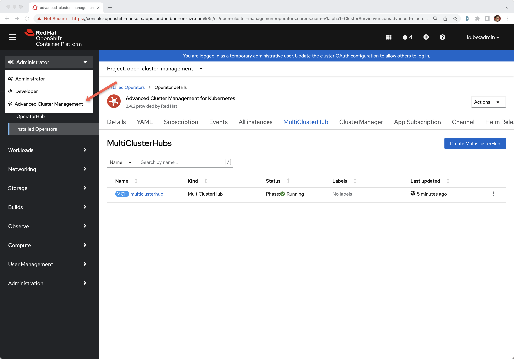[ACM Menu]

Note: It is NOT this menu option, it is confusing

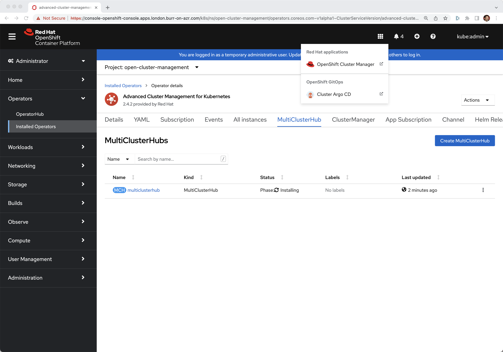[OCM Menu]

The main screen of ACM

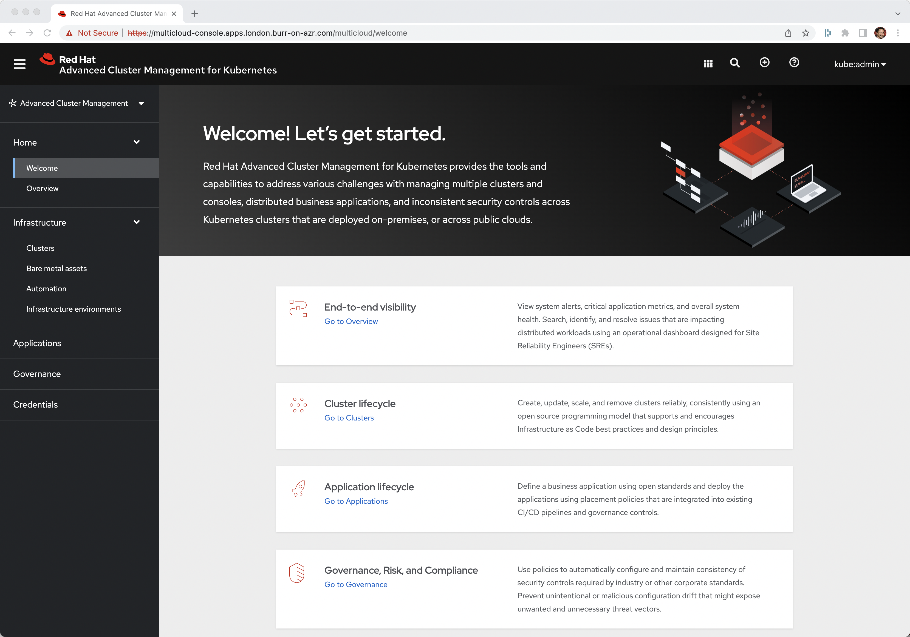[ACM Welcome]

and the Applications section, click on Create, you will see the ArgoCD ApplicationSet is disabled

image::./images/acm-argocd-3.png[][Applications in ACM]

There are some steps needed to get ArgoCD configured with ACM.  Back in the OpenShift Console - Administrator View, select the project (namespace) called "OpenShift-gitops" and Installed Operators

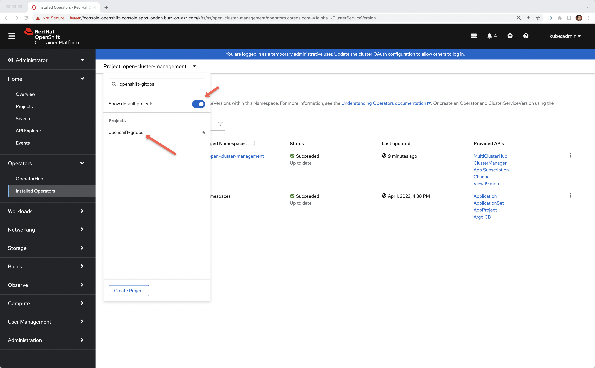[Applications in ACM]

image::./images/acm-argocd-4.png[][Installed Operators]

And visit the ArgoCD UI

image::./images/acm-argocd-5.png[][Menu for the ArgoCD Console]

And into the Settings and Clusters.  We need to add the main/hub cluster as a target for applications cluster, a managed cluster, a spoke

image::./images/acm-argocd-6.png[][Settings & Clusters]

Already a bunch of pods in openshift-gitops 
----
oc get pods -n openshift-gitops
NAME                                                         READY   STATUS    RESTARTS   AGE
cluster-ddfc8f5d5-bpf7w                                      1/1     Running   0          27m
kam-74bf75b657-zghfc                                         1/1     Running   0          27m
openshift-gitops-application-controller-0                    1/1     Running   0          26m
openshift-gitops-applicationset-controller-7fb755948-tkx8r   1/1     Running   0          26m
openshift-gitops-dex-server-7ccc8f59bf-q28bt                 1/1     Running   0          26m
openshift-gitops-redis-97574d6-cj47c                         1/1     Running   0          26m
openshift-gitops-repo-server-5c9bcccdf6-ks6qd                1/1     Running   0          26m
openshift-gitops-server-686956bfd-7k4jf                      1/1     Running   0          26m
----

You can simply just add the main/current cluster as a spoke/managed cluster but using a different technique.

----
git clone https://github.com/burrsutter/acm-argocd
cd acm-argocd
kubectl apply -f managedclusterset.yaml -n openshift-gitops
kubectl apply -f gitopscluster.yaml -n openshift-gitops
----

Check to see what managedclusters, there should only be one
----
kubectl get managedclusters -n open-cluster-management
NAME            HUB ACCEPTED   MANAGED CLUSTER URLS                      JOINED   AVAILABLE   AGE
local-cluster   true           https://api.london.burr-on-azr.com:6443   True     True        18m
----

Add a label to the local-cluster managed cluster

----
kubectl label managedcluster local-cluster cluster.open-cluster-management.io/clusterset=all-clusters -n open-cluster-management
----

Check that the label applied
----
kubectl get managedcluster -l cluster.open-cluster-management.io/clusterset=all-clusters -n open-cluster-management
NAME            HUB ACCEPTED   MANAGED CLUSTER URLS                    JOINED   AVAILABLE   AGE
local-cluster   true           https://api.iowa.burr-on-gcp.com:6443   True     True        7h48m
----

----
kubectl label managedcluster local-cluster usage=production -n open-cluster-management
----

And check that that label applied
----
kubectl get managedcluster -l usage=production -n open-cluster-management
NAME            HUB ACCEPTED   MANAGED CLUSTER URLS                      JOINED   AVAILABLE   AGE
local-cluster   true           https://api.london.burr-on-azr.com:6443   True     True        22m
----

Check the Placement - look for True and AllDecisionsScheduled

----
NAME            SUCCEEDED   REASON                  SELECTEDCLUSTERS
local-cluster   True        AllDecisionsScheduled   1

----

Check the ACM Console and Clusters

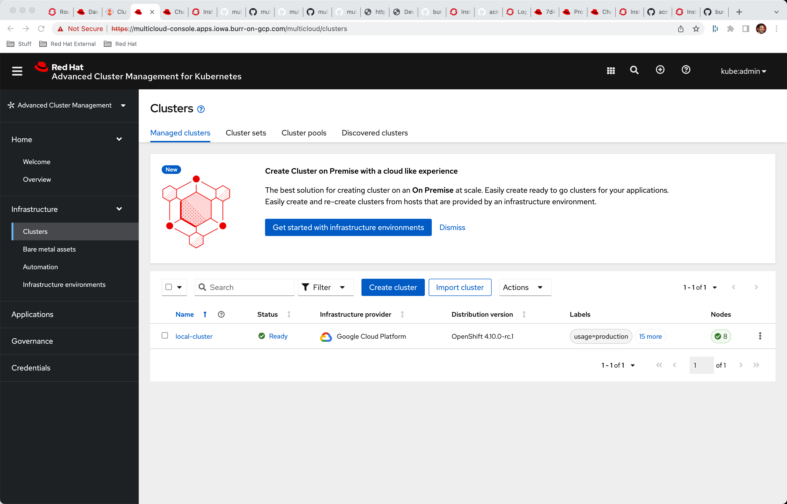[ACM Clusters]

Check the Cluster Sets

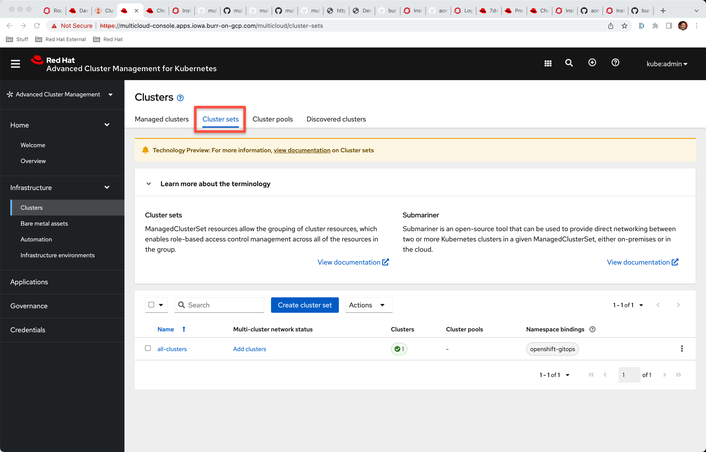[Cluster Sets]

Now Argo CD ApplicationSet should be Enabled

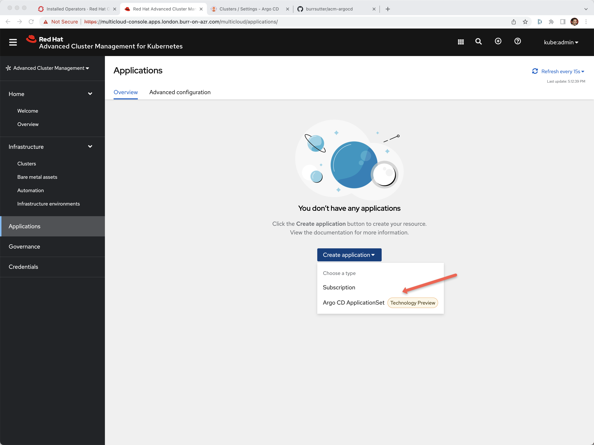[Argo CD ApplicationSet]

Select that option

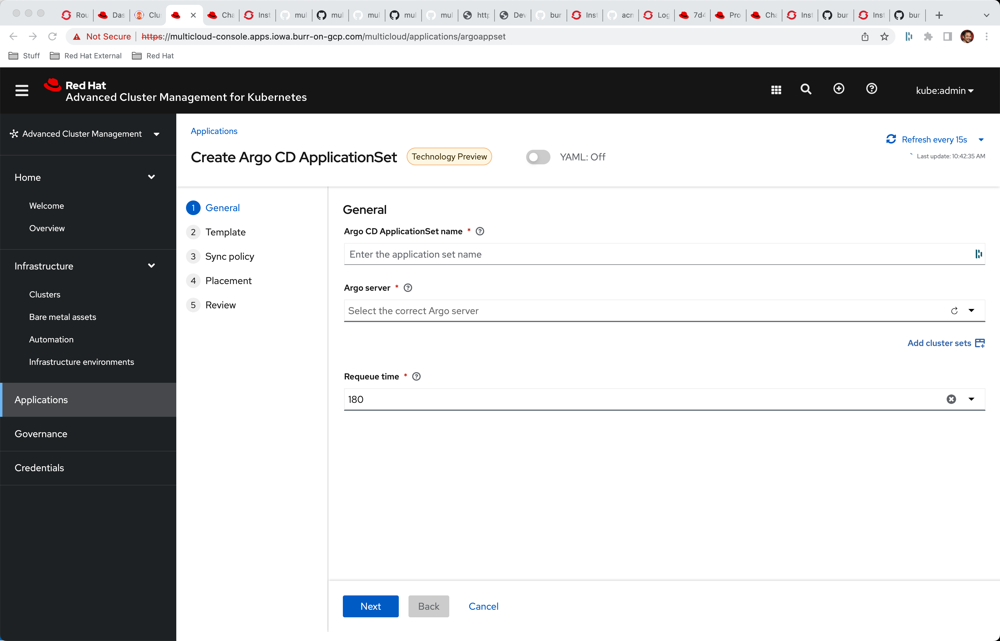[Argo CD ApplicationSet Wizard]

But let's ignore the Wizard and go back to the command line

Login using the arogocd CLI but you have to extract the CLI password from the secret 

----
ARGOCD_PASS=$(kubectl get secret/openshift-gitops-cluster -n openshift-gitops -o jsonpath='{.data.admin\.password}' | base64 -d)
echo $ARGOCD_PASS
isqn2S3902nsaiurw9nSrxJ92Ja1mSj9
----

And extra the CLI's needed URL from the Route

----
ARGOCD_URL=$(kubectl get route openshift-gitops-server -n openshift-gitops -o jsonpath="{.status.ingress[0].host}")
echo $ARGOCD_URL
openshift-gitops-server-openshift-gitops.apps.london.burr-on-azr.com
----

----
argocd login --insecure --grpc-web $ARGOCD_URL --username admin --password $ARGOCD_PASS
----

----
argocd cluster list
SERVER                                   NAME           VERSION  STATUS   MESSAGE                                              PROJECT
https://api.london.burr-on-azr.com:6443  local-cluster           Unknown  Cluster has no application and not being monitored.
https://kubernetes.default.svc           in-cluster              Unknown  Cluster has no application and not being monitored.
----

----
argocd app list
NAME  CLUSTER  NAMESPACE  PROJECT  STATUS  HEALTH  SYNCPOLICY  CONDITIONS  REPO  PATH  TARGET
----

And now all this work has been to lead up to this magical moment, apply the acm-applicationset.yaml

----
kubectl apply -f acm-applicationset.yaml -n openshift-gitops
----

----
argocd app list
NAME                 CLUSTER                                NAMESPACE  PROJECT  STATUS     HEALTH   SYNCPOLICY  CONDITIONS  REPO                                          PATH                            TARGET
local-cluster-myapp  https://api.iowa.burr-on-gcp.com:6443  mystuff    default  OutOfSync  Missing  Auto-Prune  <none>      https://github.com/burrsutter/acm-argocd.git  mystuff/overlays/local-cluster  main
----

If you look quickly it won't be synced

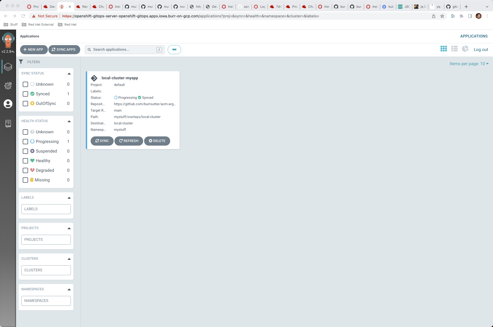[ArgoCD Console]

But it does appear in the ACM Console now

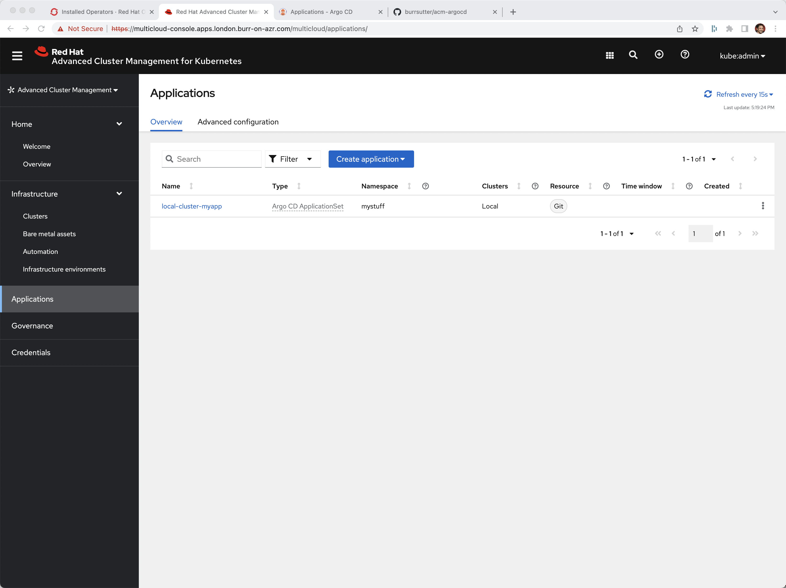[ACM Application Console]

Run that "argocd app list" command again and look for "Synced"
----
argocd app list
NAME                 CLUSTER                                NAMESPACE  PROJECT  STATUS  HEALTH   SYNCPOLICY  CONDITIONS  REPO                                          PATH                            TARGET
local-cluster-myapp  https://api.iowa.burr-on-gcp.com:6443  mystuff    default  Synced  Healthy  Auto-Prune  <none>      https://github.com/burrsutter/acm-argocd.git  mystuff/overlays/local-cluster  main
----

And it should eventually sync

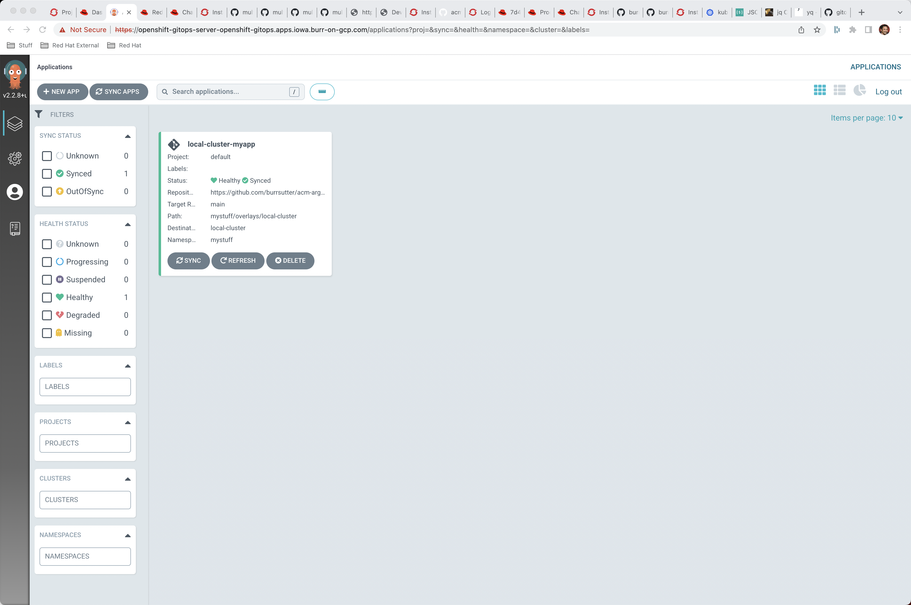[ArgoCD Console]

And be deployed into "mystuff"

----
kubectl get pods -n mystuff
NAME                     READY   STATUS    RESTARTS   AGE
myapp-74d59bc754-wt748   1/1     Running   0          75s
----

----
kubectl get services -n mystuff
NAME    TYPE           CLUSTER-IP      EXTERNAL-IP   PORT(S)          AGE
myapp   LoadBalancer   172.30.29.178   34.69.72.59   8080:30225/TCP   90s
----

----
curl 34.69.72.59:8080
localz only via Quarkus 1 on myapp-74d59bc754-wt748
----

The "localz" comes from mystuff/overlays/local-cluster.  The name of that folder is trying to match the name of a cluster and that becomes what is applied.

ToDo: Add more clusters

## ACS/StackRox

Go see the acs-hello readme.adoc

https://github.com/burrsutter/acm-argocd-acs/tree/main/acs-hello[ACS Installation]

## Troubleshooting

As mentioned, make sure you have enough worker node cores available.  You can look for Pending pods on this section of the main Overview screen.  

image::./images/troubleshooting-1.png[][Pending?]

or

----
kubectl get pods -n stackrox
NAME                         READY   STATUS    RESTARTS   AGE
central-6b96668d45-9rsqj     0/1     Pending   0          83s
scanner-7d77d75f6c-dkd7w     0/1     Pending   0          83s
scanner-7d77d75f6c-vhs2q     0/1     Running   0          83s
scanner-7d77d75f6c-zw2dw     0/1     Running   0          83s
scanner-db-77dd49d98-bn7x9   1/1     Running   0          83s
----

Check on the MachineSets

[MachineSets]

Adding workers

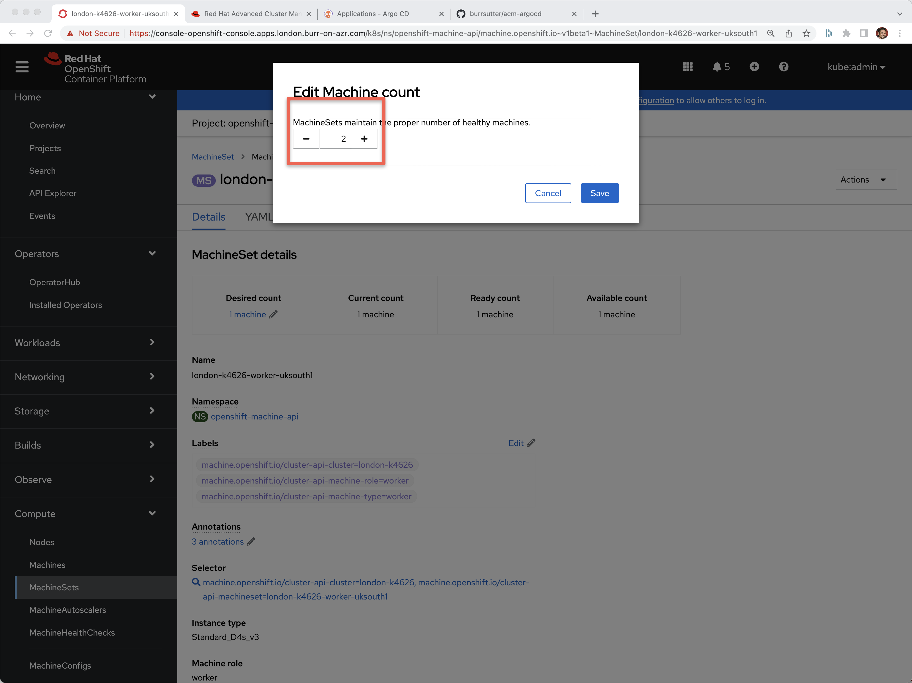[Add Worker]

And remember it can take up to 10 minutes to bring a new worker node online, it all depends on the cloud provider + region + the combo's network performance + which specific node you are assigned to and many other factors

Also check events as there might be some hints as to the reasons why something is failing/pending

----
kubectl get events --sort-by=.metadata.creationTimestamp
----